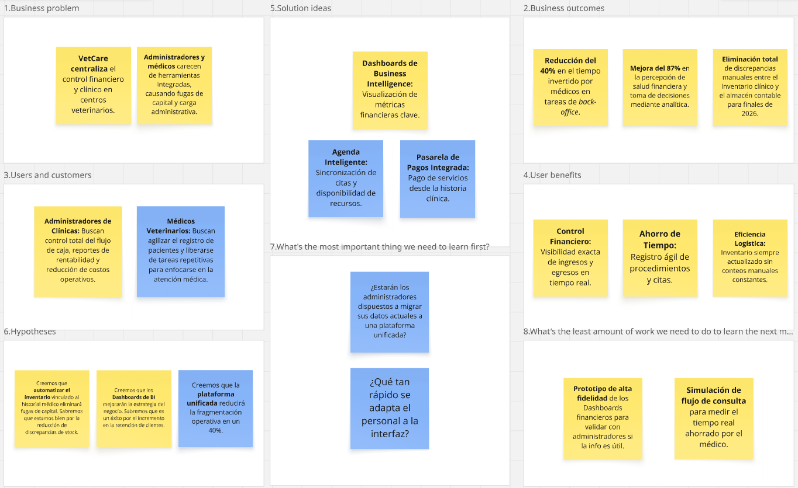

# Capítulo I: Introducción

---
## 1.1. Startup Profile

---

### 1.1.1. Descripción de la Startup

**VET-Smart** es una *startup* tecnológica enfocada en la optimización operativa y financiera del sector veterinario. Nuestro producto principal, **VetCare**, es una plataforma integral de gestión empresarial (ERP) y clínica (EHR) diseñada para centralizar y automatizar las operaciones de centros veterinarios modernos. El ecosistema permite a los **médicos veterinarios** gestionar historiales clínicos, citas y el control de inventario en tiempo real, mientras proporciona a los **administradores** herramientas avanzadas de inteligencia de negocios, control de flujos de caja y procesamiento de pagos integrados para maximizar la rentabilidad de la clínica.

| Atributo | Declaración Estratégica |
| :--- | :--- |
| **Misión** | Impulsar la eficiencia de las clínicas veterinarias mediante una plataforma integral que unifique la gestión clínica, administrativa y financiera, permitiendo a los profesionales enfocarse en la salud animal mientras aseguran la sostenibilidad y el crecimiento de su negocio. |
| **Visión** | Consolidarse como el estándar tecnológico en la gestión de centros veterinarios a nivel regional, transformando clínicas tradicionales en empresas digitales, rentables y centradas en la excelencia del servicio médico. |

#### Valor Agregado de la Plataforma:
* **Gestión Clínica Operativa:** Registro ágil de pacientes, consultas y procedimientos médicos.
* **Control de Inventario Inteligente:** Descuento automático de insumos y productos tras cada cita médica.
* **Administración Financiera:** Seguimiento detallado de ingresos y egresos con reportes visuales (dashboards) para la toma de decisiones.
* **Pasarela de Pagos Integrada:** Gestión de transacciones directamente desde la plataforma para facilitar el flujo de caja.

### 1.1.2. Perfiles de integrantes del equipo

| Nombre y Apellido | Nuñez Soto, Andy Arturo - U20231E795 |
| :--- | :--- |
| **Descripción** | Especialista en el control de calidad, testing y despliegue del producto final. Se encarga de supervisar que el código cumpla con las convenciones establecidas por el equipo para el correcto funcionamiento de VetCare en todos sus entornos. |
| **Foto** | |

 

| Nombre y Apellido | Roman Zevallos, Sebastian Jared - U202419009 |
| :--- | :--- |
| **Descripción** | Especialista en el modelado, manejo y estructuración de la información. Su labor consiste en diseñar el esquema de persistencia de datos y apoyar en el desarrollo de los servicios internos, garantizando que los registros se almacenen de forma segura y eficiente. |
| **Foto** |  |

 

| Nombre y Apellido | Romero Vilela, Dario Alberto - U202419286                                                                                                                                                                                                          |
| :--- |:---------------------------------------------------------------------------------------------------------------------------------------------------------------------------------------------------------------------------------------------------|
| **Descripción** | Desarrollador Back-End centrado en la implementación de la lógica de negocios y la integración entre los sistemas del lado del servidor. Es responsable de construir y documentar las APIs que nutren de información a toda la plataforma clínica. |
| **Foto** |                                                                                                                                                                        |

 

| Nombre y Apellido | Sanchez Benavente, Leonardo Matias - U20241B184 |
| :--- | :--- |
| **Descripción** | Lidera la construcción de la interfaz interactiva (Front-End) de VetCare. Su misión es transformar los diseños visuales de la aplicación en pantallas y componentes completamente funcionales, asegurando un rendimiento fluido y una comunicación estable. |
| **Foto** |  |

 

| Nombre y Apellido | Sejuro Medina, Mario Gabriel - U20241C198 |
| :--- | :--- |
| **Descripción** | Responsable de conceptualizar y construir la experiencia visual y de usuario (UI/UX) de la plataforma VetCare. Su principal objetivo es asegurar que la aplicación sea intuitiva, atractiva y que cumpla con los estándares de accesibilidad para todo tipo de usuarios. |
| **Foto** |  |

## 1.2. Solution Profile

**VetCare** es una plataforma integral de gestión empresarial (ERP) y clínica (EHR) diseñada para centralizar la operativa de los centros veterinarios. Nuestra solución elimina la fragmentación administrativa al unificar en un solo ecosistema el historial clínico digital, la gestión de citas, el control de inventarios con descuento automático y la administración financiera avanzada. Al proporcionar dashboards de inteligencia de negocios y pasarelas de pago integradas, VetCare permite que los administradores tomen decisiones basadas en datos reales para maximizar la rentabilidad, mientras los médicos optimizan su tiempo mediante procesos clínicos automatizados.

### 1.2.1. Antecedentes y Problemática

En el sector veterinario actual, la mayoría de los centros operan con sistemas desconectados o procesos manuales que generan ineficiencias críticas. La falta de integración entre el área médica y el área financiera provoca fugas de capital, errores en el stock de insumos y una visión incompleta de la salud financiera del negocio. Según Beyer, Chomiak-Orsa, Pietrzykowski y Rozkrut (2025), la transformación digital y la mejora de los procesos de negocio son imperativos para que las clínicas veterinarias modernas superen la fragmentación operativa y alcancen niveles competitivos de productividad.

Al analizar esta situación con la metodología de las **5 W’s y 2 H’s** se identifican los siguientes elementos:

**Who (Quiénes)**
Principalmente **administradores de clínicas veterinarias** que necesitan control total sobre el flujo de caja y la rentabilidad, y **médicos veterinarios** que requieren una herramienta ágil para gestionar historiales clínicos sin complicaciones administrativas, permitiendo un enfoque basado en datos para el manejo de casos (Mallikarjun et al., 2024).

**What (Qué)**
La problemática radica en la **fragmentación de la información operativa**. Las veterinarias carecen de una plataforma única que conecte lo que sucede en el consultorio con la contabilidad y el almacén, dificultando la gestión del inventario y el control de ingresos reales.

**When (Cuándo)**
El desafío es constante en el flujo de trabajo diario, desde la programación hasta el cobro. La ineficiencia se agudiza al no contar con sistemas que sincronicen el uso de materiales con el registro financiero en tiempo real, limitando la capacidad de respuesta de la clínica.

**Where (Dónde)**
En la **infraestructura operativa de las clínicas veterinarias** urbanas. El problema se localiza en el "back-office" del negocio, donde la ausencia de herramientas de Business Intelligence (BI) impide una toma de decisiones estratégica. Según Soltani y Siadati (2019), la implementación de BI tiene un impacto directo en el incremento de la eficiencia y la calidad de la salud en centros especializados.

**Why (Por qué)**
Las causas principales son:
* **Sistemas aislados:** Uso de herramientas manuales que no se comunican con el historial médico, obstaculizando la mejora de procesos (Beyer et al., 2025).
* **Fugas de inventario:** Falta de un sistema que descuente automáticamente los insumos utilizados en cada cita médica.
* **Carencia de analítica:** Los administradores no cuentan con reportes visuales en tiempo real para identificar la rentabilidad real de sus servicios.

**How (Cómo)**
Se manifiesta en una administración reactiva, pérdida de stock y procesos de pago lentos. Según Beyer et al. (2025), la digitalización es la clave para reestructurar estos procesos y eliminar las redundancias que afectan la rentabilidad.

**How Much (Cuánto)**
* La transformación digital permite optimizar los procesos de negocio en clínicas veterinarias, reduciendo errores operativos significativamente (Beyer et al., 2025).
* La implementación de herramientas de inteligencia de negocios (BI) incrementa la eficiencia operativa y la calidad del servicio en centros de salud, según Soltani y Siadati (2019).
* El uso de sistemas de entrenamiento y gestión de datos estandarizados permite una precisión diagnóstica superior y un mejor manejo de recursos, tal como se observa en estudios de detección y manejo animal (Mallikarjun et al., 2024).

### 1.2.2. Lean UX Process

#### 1.2.2.1. Lean UX Problem Statements

**Problem Statement 1: Enfoque en la Gestión Administrativa y Financiera**
Nuestra solución, VetCare, ofrece una plataforma de gestión empresarial (ERP) diseñada para centralizar el control financiero y logístico de los centros veterinarios. A través del ecosistema, los administradores acceden a herramientas de inteligencia de negocios, control de inventario con descuento automático y pasarelas de pago integradas, contribuyendo a maximizar la rentabilidad operativa del negocio.

Se ha identificado que los administradores de clínicas veterinarias operan con sistemas financieros y de almacén desconectados de la operativa médica real. Esta falta de integración provoca fugas de capital, errores recurrentes en el stock de insumos y una visión incompleta de la salud financiera, impidiendo una toma de decisiones estratégica.

Por tanto, nos preguntamos: **¿Cómo podríamos proporcionar a los administradores una plataforma unificada que sincronice el uso clínico de insumos con la contabilidad en tiempo real, reduciendo las pérdidas de inventario y facilitando el control exacto del flujo de caja?**

---

**Problem Statement 2: Enfoque en la Eficiencia Clínica y Médica**
Nuestra solución, VetCare, ofrece un ecosistema clínico digital (EHR) que permite a los médicos veterinarios gestionar historiales, programar citas y registrar procedimientos de forma ágil e integrada. Esto elimina la fragmentación administrativa en el consultorio y optimiza el tiempo que el profesional dedica a la atención médica.

Se ha identificado que el personal médico sufre de una carga administrativa excesiva debido a procesos manuales, uso de herramientas analógicas o sistemas genéricos que no se comunican con el *back-office*. Esta duplicidad de tareas reduce drásticamente su eficiencia operativa, consumiendo hasta un 40% del tiempo que debería estar destinado al cuidado efectivo del paciente.

Por tanto, nos preguntamos: **¿Cómo podríamos ofrecer a los médicos veterinarios una herramienta clínica automatizada que elimine las tareas administrativas repetitivas, permitiéndoles optimizar la duración de sus consultas y enfocarse al cien por ciento en la atención al paciente?**

#### 1.2.2.2. Lean UX Assumptions

* **Creo que mis clientes necesitan** centralizar su operativa clínica y financiera en un solo entorno digital, ya que la desconexión actual de sistemas genera fugas de inventario, pérdida de capital y un exceso de horas invertidas en tareas administrativas.
* **Estas necesidades se pueden resolver mediante** nuestra plataforma VetCare, que unifica el historial clínico con el control de inventarios (aplicando descuentos automáticos por uso), integra pasarelas de pago y proporciona dashboards financieros en tiempo real.
* **Mis clientes iniciales serán** administradores enfocados en la eficiencia financiera y médicos veterinarios de clínicas urbanas de mediano a alto flujo que requieren modernizar su gestión para manejar la creciente demanda de servicios.
* **El valor #1 que un cliente quiere de nuestro servicio es** la eliminación de la duplicidad de tareas, obteniendo un control exacto de los ingresos y el stock sin sacrificar el tiempo vital dedicado a la consulta médica.
* **El cliente también puede obtener estos beneficios adicionales mediante** el seguimiento detallado de ingresos y egresos, una programación ágil de citas y un ecosistema de pagos integrado que mejora sustancialmente la experiencia final del dueño de la mascota.
* **Voy a adquirir la mayoría de mis clientes a través de** estrategias de venta B2B directa, demostraciones del software enfocadas en el retorno de inversión (ROI) operativo y participación en eventos o congresos de gestión veterinaria a nivel local.
* **Haré dinero a través de** un modelo de suscripción (SaaS) escalonado según el tamaño de la clínica (número de usuarios o sucursales) y mediante comisiones transaccionales derivadas del uso de la pasarela de pagos integrada en el ecosistema.
* **Mi competencia principal en el mercado serán** los softwares de gestión veterinaria genéricos que funcionan únicamente como agendas o historias clínicas estáticas, así como el uso de herramientas ofimáticas tradicionales para llevar la contabilidad.
* **Los venceremos debido a nuestro valor diferencial:** la capacidad de conectar directamente la acción médica (EHR) con el impacto financiero (ERP), ofreciendo inteligencia de negocios y automatización del flujo de caja en una interfaz altamente intuitiva.
* **Mi mayor riesgo de producto es** la resistencia al cambio y la curva de aprendizaje por parte del personal de clínicas acostumbradas a procesos analógicos. Resolveremos esto diseñando una experiencia de usuario (UX) impecable, ofreciendo soporte constante y demostrando rápidamente la reducción de su carga de trabajo diaria.

#### 1.2.2.3. Lean UX Hypothesis Statements

* **Hipótesis 1 (Enfoque Logístico y Financiero)**
  Creemos que automatizar el control de inventario, vinculando el descuento de insumos directamente a los registros del historial clínico, eliminará las fugas de capital por errores manuales.
  *Sabremos que estamos bien cuando* las clínicas que implementen VetCare reporten una reducción significativa en las discrepancias de stock a fin de mes y mejoren su correlación de eficiencia operativa.

* **Hipótesis 2 (Enfoque Estratégico y Analítico)**
  Creemos que proporcionar a los administradores dashboards de inteligencia de negocios con seguimiento detallado de ingresos y egresos mejorará sustancialmente la toma de decisiones estratégicas.
  *Sabremos que estamos bien cuando* los centros veterinarios logren incrementar su retención de clientes y reporten una mejora en su percepción de salud financiera en hasta un 87%, validando el impacto de la analítica en tiempo real.

* **Hipótesis 3 (Enfoque Clínico y Operativo)**
  Creemos que integrar la programación de citas, el historial médico y la pasarela de pagos en una única plataforma digital reducirá la fragmentación operativa del personal médico.
  *Sabremos que estamos bien cuando* las métricas de uso y las evaluaciones de los médicos veterinarios demuestren una reducción del 40% en el tiempo invertido en tareas de *back-office*.

#### 1.2.2.4. Lean UX Canvas

## 1.3. Segmentos objetivo

---

El mercado peruano exige la modernización de los servicios de salud animal. Según CPI (2023), la mayoría de hogares urbanos tiene mascotas, elevando la demanda veterinaria. Sin embargo, gremios como la Cámara de Comercio de Lima (2022) advierten que, pese a la apertura de más clínicas, persisten desafíos de gestión y falta de digitalización que limitan su eficiencia y rentabilidad.

Dentro de este panorama, VET-Smart concentrará su fase inicial en dos segmentos clave:

* **Médicos veterinarios en clínicas de mediano a alto flujo** que carecen de herramientas integradas. La gestión manual de historiales e inventarios consume un tiempo crítico. Ante la alta demanda, requieren una plataforma clínica (EHR) en tiempo real para optimizar consultas, controlar medicamentos y mejorar la atención al paciente, reduciendo su dependencia de procesos analógicos.

* **Administradores de centros veterinarios**, usualmente entre 30 y 55 años, enfocados en la eficiencia operativa y financiera. La plataforma (ERP) les brindará herramientas de inteligencia de negocios, control de flujo de caja y pagos integrados mediante reportes claros, facilitando decisiones para maximizar la rentabilidad.

Esta selección prioriza usuarios con una necesidad crítica de optimización y mayor disposición tecnológica. Esto permitirá una implementación ágil y generará evidencia de impacto para, en el futuro, expandirse hacia otros segmentos del mercado del cuidado animal.
