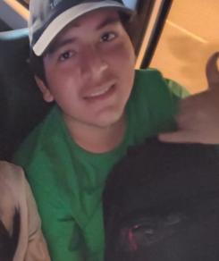
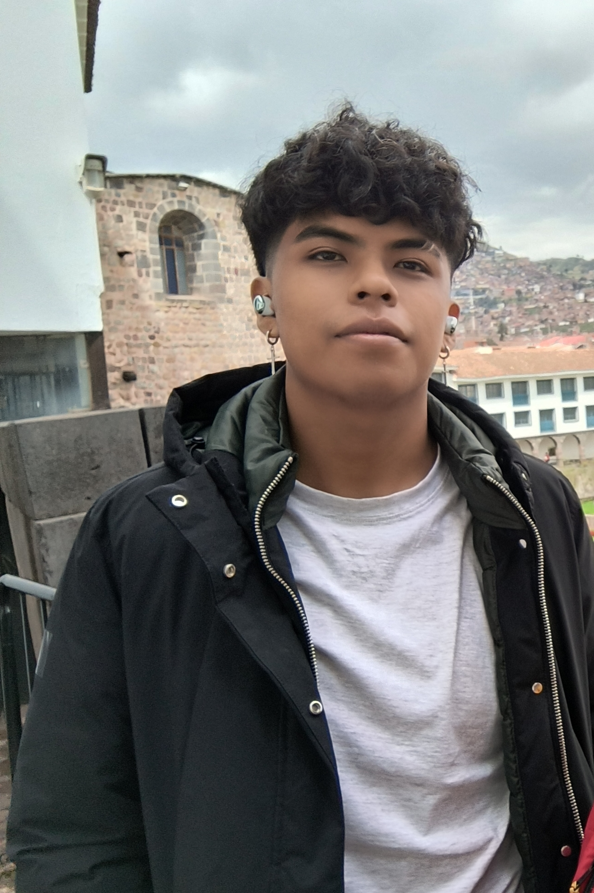

# Capítulo I: Introducción

---

## 1.1. Startup Profile

---

### 1.1.1. Descripción de la Startup

**VET-SmartDiet** es una *startup* tecnológica emergente enfocada en la digitalización y mejora del sector veterinario. A través de nuestro producto principal, **VetCare**, ofrecemos una plataforma integral de gestión clínica que conecta el cuidado médico veterinario con el seguimiento continuo por parte de los propietarios. Nuestro propósito es transformar el cuidado preventivo y el tratamiento de las mascotas mediante un ecosistema digital que automatice procesos, facilite la comunicación y sincronice la atención clínica con el bienestar en el hogar.

| Atributo | Declaración Estratégica |
| :--- | :--- |
| **Misión** | Garantizar la salud y el bienestar integral de las mascotas mediante herramientas de software clínico que faciliten el control preventivo, optimicen los diagnósticos y aseguren el estricto cumplimiento terapéutico bajo una constante supervisión médica y tecnológica. |
| **Visión** | Ser el ecosistema digital líder en el sector de la medicina veterinaria a nivel regional, redefiniendo la interacción entre especialistas y dueños a través de tecnología innovadora que garantice la longevidad y mejore la calidad de vida animal. |

### 1.1.2. Perfiles de integrantes del equipo

| Nombre y Apellido | Nuñez Soto, Andy Arturo - U20231E795 |
| :--- | :--- |
| **Descripción** | Especialista en el control de calidad, testing y despliegue del producto final. Se encarga de supervisar que el código cumpla con las convenciones establecidas por el equipo para el correcto funcionamiento de VetCare en todos sus entornos. |
| **Foto** | _(Pendiente)_ |

 

| Nombre y Apellido | Roman Zevallos, Sebastian Jared - U202419009 |
| :--- | :--- |
| **Descripción** | Especialista en el modelado, manejo y estructuración de la información. Su labor consiste en diseñar el esquema de persistencia de datos y apoyar en el desarrollo de los servicios internos, garantizando que los registros se almacenen de forma segura y eficiente. |
| **Foto** |  |

 

| Nombre y Apellido | Romero Vilela, Dario Alberto - U202419286 |
| :--- | :--- |
| **Descripción** | Desarrollador Back-End centrado en la implementación de la lógica de negocios y la integración entre los sistemas del lado del servidor. Es responsable de construir y documentar las APIs que nutren de información a toda la plataforma clínica. |
| **Foto** |  |

 

| Nombre y Apellido | Sanchez Benavente, Leonardo Matias - U20241B184 |
| :--- | :--- |
| **Descripción** | Lidera la construcción de la interfaz interactiva (Front-End) de VetCare. Su misión es transformar los diseños visuales de la aplicación en pantallas y componentes completamente funcionales, asegurando un rendimiento fluido y una comunicación estable. |
| **Foto** |  |

 

| Nombre y Apellido | Sejuro Medina, Mario Gabriel - U20241C198 |
| :--- | :--- |
| **Descripción** | Responsable de conceptualizar y construir la experiencia visual y de usuario (UI/UX) de la plataforma VetCare. Su principal objetivo es asegurar que la aplicación sea intuitiva, atractiva y que cumpla con los estándares de accesibilidad para todo tipo de usuarios. |
| **Foto** |  |

## 1.2. Solution Profile

---

### 1.2.1. Antecedentes y problemática

### 1.2.2. Lean UX Process

#### 1.2.2.1. Lean UX Problem Statements

#### 1.2.2.2. Lean UX Assumptions

#### 1.2.2.3. Lean UX Hypothesis Statements

#### 1.2.2.4. Lean UX Canvas

## 1.3. Segmentos objetivo

---
