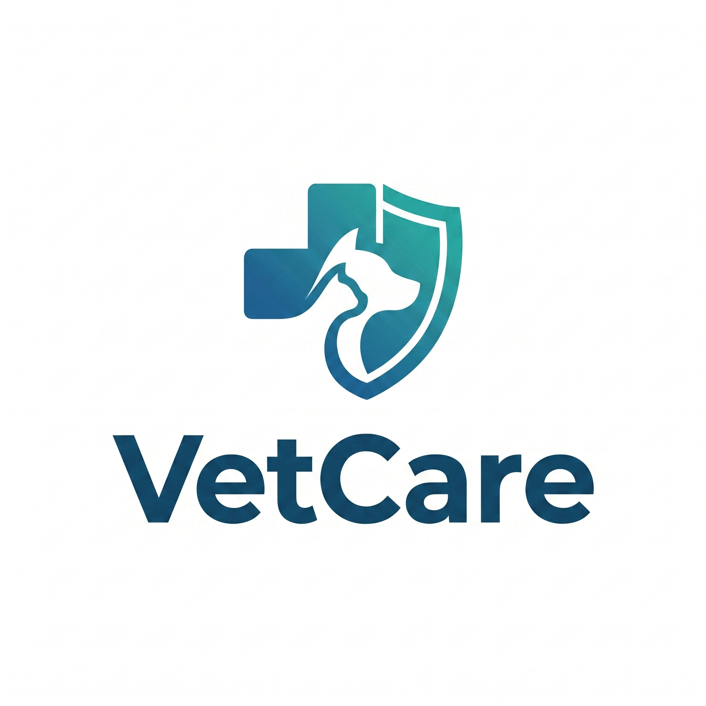
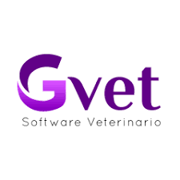
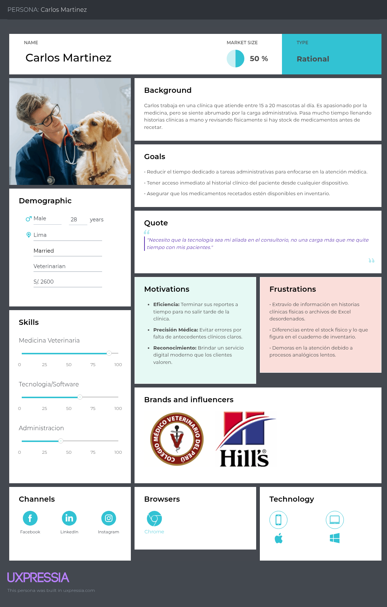
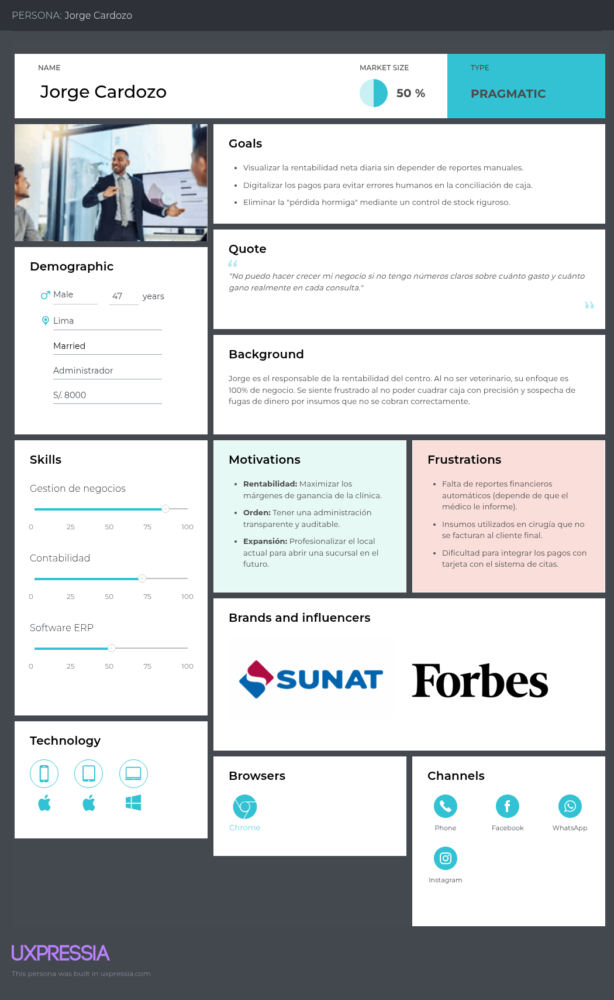
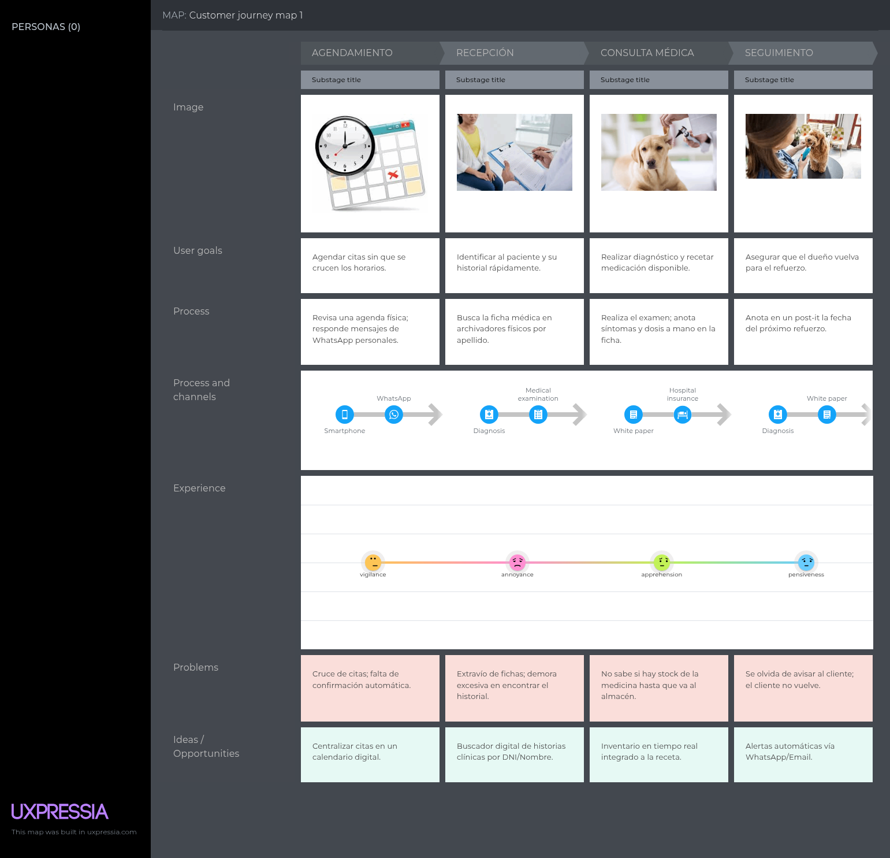
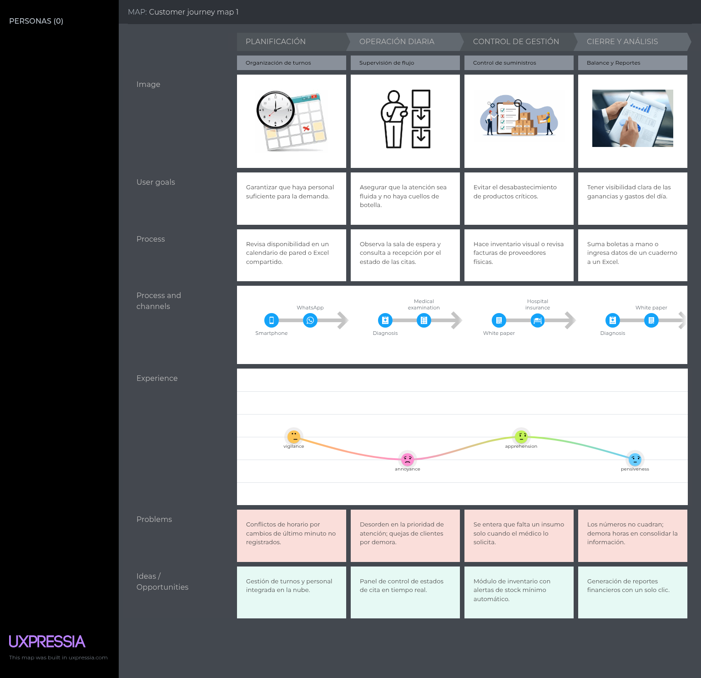
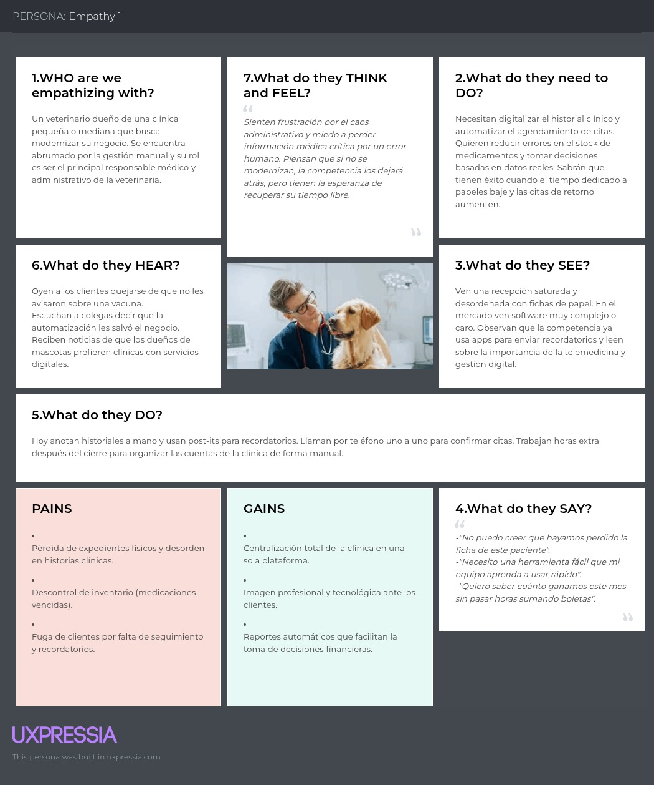
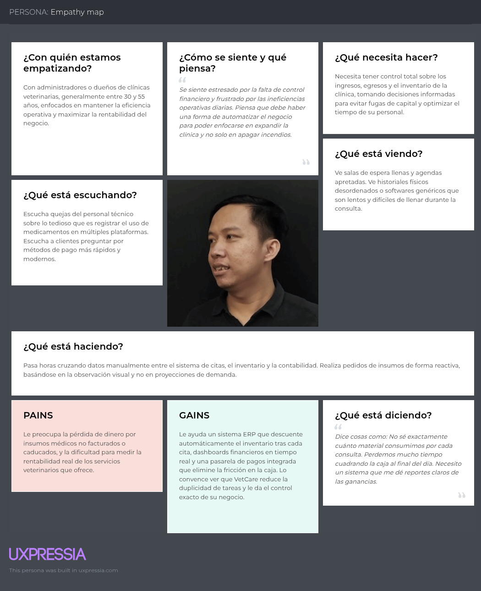

# Capítulo II: Requirements Elicitation & Analysis

---

## 2.1. Competidores

---
**GVET**  GVET es una plataforma integral "todo en uno" diseñada para la gestión clínica y administrativa de centros veterinarios en Latinoamérica. Su fortaleza radica en la **sincronización en tiempo real** entre el área médica y la administrativa: permite a los veterinarios gestionar historias clínicas detalladas mientras el sistema automatiza el control de stock y las comisiones por médico. Sin embargo, aunque es muy robusto en la gestión operativa, su interfaz puede resultar compleja para usuarios nuevos y la profundidad de sus reportes financieros avanzados suele estar reservada para planes de alto costo, lo que limita el acceso a analítica de datos en clínicas pequeñas.

**QVET**  QVET es uno de los softwares de gestión veterinaria más consolidados a nivel global, enfocado en la **estandarización de procesos y contabilidad**. Se destaca por su potente módulo de ERP, que permite una gestión exhaustiva de ingresos y egresos, auditorías de inventario y facturación electrónica integrada. Su principal ventaja es la solidez en la administración de grandes centros hospitalarios; no obstante, su arquitectura se siente menos ágil que las soluciones nativas en la nube más modernas, y su enfoque está tan volcado a la administración que la experiencia de usuario para el médico veterinario en consulta suele ser menos intuitiva.

**Wakyma Vets**  Wakyma es una solución *cloud-native* moderna que pone el foco en la **experiencia de usuario (UX) y la fidelización del cliente**. Su fortaleza reside en un dashboard administrativo simplificado que prioriza la visibilidad de la rentabilidad diaria y la automatización de recordatorios de pago y citas mediante canales digitales. Es ideal para clínicas que buscan digitalización rápida con una curva de aprendizaje mínima. Por el contrario, su capacidad de personalización en el control de inventarios críticos (insumos médicos específicos) es menor comparada con sistemas más robustos, y su enfoque es más comercial que puramente médico-hospitalario.
### 2.1.1. Análisis competitivo
#### Competitive Analysis Landscape

| **Título del Análisis** | **Competitive Analysis Landscape** |
| :--- | :--- |
| **¿Por qué llevar a cabo este análisis?** | Identificar brechas operativas y financieras en las soluciones actuales para posicionar a VetCare como el ERP/EHR líder en trazabilidad de insumos y gestión de rentabilidad real en el mercado peruano.    Comparación por criterios estratégicos, operativos y de modelo de negocio. |
 

| **Categoría** | **Criterio** | 
 **Nuestra Startup: VetCare**
 | 
 **Competidor 1: Gvet**
 | 
 **Competidor 2: qvet**
 | 
 **Competidor 3: Wakyma Vets**
 |
| :--- | :--- | :--- | :--- | :--- | :--- |
| **Perfil** | Overview | Plataforma SaaS integral (ERP/EHR) con enfoque en control de utilidades. | Ecosistema digital centrado en la experiencia de usuario y movilidad. | Software de larga trayectoria especializado en administración contable. | Solución cloud-native moderna enfocada en marketing y fidelización. |
| | Ventaja Competitiva | Trazabilidad exacta de insumos (gasto por cita) y dashboards de utilidad neta real. | Integración fluida entre la app del dueño de mascota y el historial clínico. | Robustez contable absoluta y cumplimiento de normativas de auditoría complejas. | Automatización de la comunicación con el cliente y facilidad de uso (UX/UI). |
| **Perfil de   Marketing** | Mercado Objetivo | Clínicas veterinarias en crecimiento en Perú (Admin + Médicos). | Clínicas veterinarias medianas y grandes en Latinoamérica. | Hospitales veterinarios y cadenas con alta carga administrativa. | Veterinarias jóvenes que buscan digitalización rápida y comercial. |
| | Estrategias de   Marketing | Inbound marketing enfocado en eficiencia operativa y gestión financiera. | Presencia fuerte en redes sociales y alianzas con facultades de veterinaria. | Venta directa corporativa y presencia en congresos internacionales. | Marketing digital agresivo y periodos de prueba gratuitos (Freemium). |
| **Perfil de   Producto** | Productos &   Servicios | Gestión clínica (EHR), ERP financiero, inventario automático y pagos integrados. | Gestión de citas, historia clínica, tienda online y app para propietarios. | ERP contable, facturación SUNAT, laboratorios y hospitalización. | Agenda digital, recordatorios automáticos, ficha médica y analítica. |
| | Precios & Costos | Modelo de suscripción mensual (SaaS) escalable por transacciones. | Suscripción por módulos con costos adicionales por usuarios/sedes. | Licenciamiento inicial más costo de mantenimiento anual elevado. | Suscripción mensual competitiva basada en pacientes activos. |
| | Canales de   Distribución | Plataforma Web (SaaS) responsiva. | Web y aplicación móvil nativa. | Software local con servicios en la nube e interfaz web. | Multiplataforma: Web, Android e iOS. |

 

### Análisis SWOT (FODA)

| Categoría | 
 VetCare
 | 
 Gvet
 | 
 qVet
 | 
 Wakyma Vets
 |
| :--- | :--- | :--- | :--- | :--- |
| **Fortalezas** | Trazabilidad exacta de insumos y dashboards financieros simplificados. | Comunidad activa y excelente integración móvil. | Alta confiabilidad contable y cumplimiento legal. | Interfaz moderna y procesos de comunicación automatizados. |
| **Debilidades** | Producto nuevo en fase de desarrollo (menor historial de marca). | Curva de aprendizaje técnica para el personal administrativo. | Interfaz antigua y procesos de configuración complejos. | Funcionalidades de inventario médico menos profundas. |
| **Oportunidades** | Crecimiento de la demanda de digitalización en veterinarias peruanas. | Expansión a servicios de telemedicina integrados. | Migración de clientes antiguos a sus nuevas versiones cloud. | Liderar el mercado de pequeñas clínicas con modelos low-cost. |
| **Amenazas** | Competidores establecidos con mayores presupuestos de marketing. | Entrada de softwares genéricos de citas que bajen precios. | Nuevas normativas gubernamentales que exijan cambios. | Consolidación de otras plataformas de pagos competidoras. |
### 2.1.2. Estrategias y Tácticas frente a Competidores

| **Categoría** | **Estrategia** | **Táctica** |
| :--- | :--- | :--- |
| **Estrategias Ofensivas** | Diferenciación por precisión financiera (vs. GVET/Wakyma) | Implementar el módulo **"Gasto por Procedimiento"** para descontar insumos exactos (ml, unidades) en cada cita, calculando la utilidad neta real al instante. |
| | Modernización de la experiencia clínica (vs. QVET) | Diseñar una interfaz **"Single Page"** que permita al médico registrar la atención y el consumo de stock en una sola pantalla, eliminando la lentitud de los sistemas antiguos. |
| **Estrategias Defensivas** | Localización y cumplimiento normativo (vs. Softwares Globales) | Integración nativa con **SUNAT** y pasarelas de pago locales (**Izipay/Niubiz**) para ofrecer una solución lista para el mercado peruano sin configuraciones externas. |
| | Reducción de barreras de entrada (vs. QVET) | Aplicar un modelo de **suscripción SaaS escalable** sin costo de licencia inicial, facilitando que clínicas pequeñas adopten la tecnología sin descapitalizarse. |
| **Estrategias de Crecimiento** | Marketing de autoridad financiera | Ejecutar una estrategia de **Inbound Marketing** basada en la rentabilidad, usando los Dashboards de VetCare como gancho para atraer administradores preocupados por el control de costos. |
| | Retención por ecosistema integrado | Centralizar la facturación y los pagos dentro de la plataforma para generar una dependencia positiva basada en la **eficiencia operativa**, dificultando la migración a otros sistemas. |
## 2.2. Entrevistas

---

### 2.2.1. Diseño de entrevistas

#### Segmento 1: Médico Veterinario
1. En tu día a día, ¿qué tareas administrativas sientes que te quitan más tiempo de la atención a las mascotas? 
2. Cuando atiendes a un paciente, ¿cómo registras actualmente la información médica? 
3. ¿Te ha pasado que pierdes información o no encuentras rápidamente el historial de una mascota? ¿Cómo lo solucionas? 
4. ¿Cuánto tiempo dirías que dedicas a llenar datos o registros después de cada consulta? 
5. ¿Qué tan fácil o difícil es para ti gestionar las citas y organizar tu agenda diaria? 
6. Cuando tienes varios pacientes al mismo tiempo, ¿qué es lo más complicado de manejar? 
7. ¿Te ha ocurrido olvidar algún detalle importante como medicación, vacuna o seguimiento? ¿Por qué crees que pasa? 
8. ¿Qué herramientas o sistemas usas actualmente? ¿Qué es lo que más te frustra de ellos? 
9. Si pudieras eliminar o mejorar una parte de tu trabajo administrativo, ¿cuál sería y por qué? 
10. ¿Cómo te gustaría que un sistema ideal te ayude durante una consulta para que sea más rápida y ordenada? 

#### Segmento 2: Administrador / Propietario de Veterinaria
1. ¿Cómo gestionas actualmente los ingresos, gastos y pagos dentro de tu clínica? 
2. ¿Te resulta fácil saber cuánto estás ganando realmente al final del mes? ¿Por qué? 
3. ¿Qué problemas has tenido con el control de pagos o facturación? 
4. ¿Te ha pasado que se te escapan cobros o servicios no registrados? ¿Con qué frecuencia? 
5. ¿Cómo controlas el inventario de medicamentos y productos? ¿Es un proceso confiable? 
6. ¿Cuánto tiempo dedicas a tareas administrativas en comparación con la gestión del negocio? 
7. ¿Qué tan difícil es obtener reportes claros sobre el rendimiento de tu clínica? 
8. ¿Qué herramientas utilizas actualmente y qué limitaciones encuentras en ellas? 
9. ¿Qué impacto crees que tiene la desorganización administrativa en tus ingresos? 
10. Si pudieras automatizar una parte del negocio hoy, ¿cuál sería y qué beneficio esperas obtener?

### 2.2.2. Registro de entrevistas

### 2.2.3. Análisis de entrevistas

## 2.3. Needfinding

---

### 2.3.1. User Personas
#### User Persona 1: Medico Veterinario

 
 

##### User Persona 2: Administrador de Veterinaria

 

### 2.3.2. User Task Matrix

En esta sección se presenta la matriz de tareas que realizan los segmentos objetivo independientemente de la solución de software propuesta. Se analizan las actividades de **Carlos Mendoza (Médico)** y **Jorge Cardozo(Administrador)**, permitiendo identificar los puntos críticos de su flujo de trabajo actual.

<table>
    <thead>
        <tr>
            <th rowspan="2" valign="middle">User Task Matrix</th>
            <th colspan="2" align="center">Dr. Carlos Mendoza (Médico)</th>
            <th colspan="2" align="center">Jorge Cardozo (Administrador)</th>
        </tr>
        <tr>
            <th align="center">Frecuencia</th>
            <th align="center">Importancia</th>
            <th align="center">Frecuencia</th>
            <th align="center">Importancia</th>
        </tr>
    </thead>
    <tbody>
        <tr>
            <td>Registrar historia clínica y síntomas del paciente</td>
            <td align="center">3</td>
            <td align="center">3</td>
            <td align="center">1</td>
            <td align="center">1</td>
        </tr>
        <tr>
            <td>Controlar el stock de medicamentos e insumos médicos</td>
            <td align="center">3</td>
            <td align="center">3</td>
            <td align="center">2</td>
            <td align="center">3</td>
        </tr>
        <tr>
            <td>Agendar y organizar las citas del día</td>
            <td align="center">3</td>
            <td align="center">2</td>
            <td align="center">2</td>
            <td align="center">3</td>
        </tr>
        <tr>
            <td>Realizar el cobro de servicios y productos al cliente</td>
            <td align="center">3</td>
            <td align="center">3</td>
            <td align="center">3</td>
            <td align="center">3</td>
        </tr>
        <tr>
            <td>Conciliar ingresos diarios con medios de pago</td>
            <td align="center">1</td>
            <td align="center">1</td>
            <td align="center">3</td>
            <td align="center">3</td>
        </tr>
        <tr>
            <td>Generar reportes de ventas y utilidad mensual</td>
            <td align="center">1</td>
            <td align="center">1</td>
            <td align="center">2</td>
            <td align="center">3</td>
        </tr>
        <tr>
            <td>Emitir comprobantes de pago (SUNAT)</td>
            <td align="center">2</td>
            <td align="center">2</td>
            <td align="center">3</td>
            <td align="center">3</td>
        </tr>
        <tr>
            <td>Notificar recordatorios de vacunas o citas</td>
            <td align="center">2</td>
            <td align="center">2</td>
            <td align="center">1</td>
            <td align="center">2</td>
        </tr>
        <tr>
            <td>Verificar la rentabilidad de procedimientos</td>
            <td align="center">1</td>
            <td align="center">2</td>
            <td align="center">2</td>
            <td align="center">3</td>
        </tr>
    </tbody>
</table>

**Leyenda:**
* **Frecuencia:** 1 (Baja), 2 (Media), 3 (Alta).
* **Importancia:** 1 (Baja), 2 (Media), 3 (Alta).

---

#### Análisis de resultados

Tras el análisis de la matriz, se desprenden las siguientes observaciones:

* **Tareas con mayor coincidencia:** La **gestión de citas** es la tarea central donde ambos perfiles interactúan con alta frecuencia e importancia. Para el médico es su hoja de ruta diaria, mientras que para la administración representa el flujo de caja proyectado.
* **Tareas críticas para el Veterinario (Carlos):** Sus tareas con puntuación máxima **(3/3)** están ligadas directamente al **registro clínico** y al **control de stock**. Esto valida que el veterinario prioriza la continuidad operativa; sin historial o insumos, su trabajo se detiene.
* **Tareas críticas para el Administrador (Jorge):** Elena concentra sus valores máximos en la **conciliación de ingresos** y la **emisión de comprobantes**. Su prioridad es la legalidad (SUNAT) y la salud financiera del negocio.
* **Diferencias principales:** El médico tiene una participación mínima en las tareas de **reportes financieros y conciliación** (frecuencia e importancia 1), delegando totalmente esa responsabilidad en la administradora, quien utiliza estos datos para la toma de decisiones estratégicas.
### 2.3.3. User Journey Mapping

---

### 2.3.4. Empathy Mapping

---

## 2.4. Big Picture EventStorming

---

## 2.5. Ubiquitous Language

---

#### 1. Core Domain (Conceptos Generales del Negocio)
* **Clinic (Clínica):** El establecimiento físico o centro veterinario donde se brindan los servicios médicos, estéticos y administrativos para los animales.
* **Pet Owner (Propietario / Cliente):** La persona física responsable legal y financieramente del animal, quien solicita y autoriza los servicios de la clínica.
* **Patient (Paciente):** El animal que recibe la atención médica o los servicios dentro del establecimiento veterinario.
* **Veterinarian (Médico Veterinario):** El profesional colegiado de la salud animal encargado de evaluar, diagnosticar, tratar y prescribir medicamentos a los pacientes.
* **Staff (Personal):** Empleados de la clínica que no realizan actos médicos, encargados de la recepción, asistencia administrativa o mantenimiento.

#### 2. Clinical Module (Módulo Clínico - EHR)
* **Electronic Health Record (Historial Clínico):** Documento digital unificado e inmutable que centraliza toda la información de salud de un paciente a lo largo del tiempo, incluyendo alergias, vacunas, peso y atenciones previas.
* **Triage (Triaje):** Evaluación inicial de los signos vitales (peso, temperatura, frecuencia cardíaca) y el motivo de consulta del paciente para determinar el nivel de urgencia antes de la atención médica.
* **Consultation (Consulta Médica):** El acto médico principal en el que el veterinario examina al paciente, emite un diagnóstico y establece un plan de tratamiento.
* **Diagnosis (Diagnóstico):** La conclusión clínica oficial sobre la patología, enfermedad o condición que padece el paciente, determinada por el veterinario.
* **Medical Exam (Examen Médico):** Pruebas complementarias de laboratorio o diagnóstico por imágenes (radiografías, ecografías, análisis de sangre) solicitadas para apoyar el diagnóstico clínico.
* **Prescription (Receta Médica):** Indicación terapéutica oficial formulada por el médico veterinario que detalla los medicamentos, dosis, frecuencia y duración del tratamiento que debe seguir el paciente.
* **Vaccination Schedule (Cronograma de Vacunación):** Calendario preventivo programado que indica las fechas en las que el paciente debe recibir sus vacunas y desparasitaciones periódicas.

#### 3. Administrative & Financial Module (Módulo de Gestión - ERP)
* **Appointment (Cita):** Espacio de tiempo específico reservado y confirmado en la agenda de la clínica para que un médico veterinario evalúe a un paciente o se le realice un servicio.
* **Inventory (Inventario):** Catálogo general y registro actualizado de todos los medicamentos, insumos médicos, alimentos y productos de venta disponibles en la clínica.
* **Stock (Existencias):** La cantidad física y real disponible de un producto o medicamento específico dentro de la clínica en un momento determinado.
* **Supplier (Proveedor):** La empresa o entidad comercial externa que abastece a la clínica de medicamentos, equipamiento o productos de venta.
* **Service (Servicio):** Cualquier actividad intangible ofrecida por la clínica que genera un costo, como consultas, cirugías, baños o cortes de pelo.
* **Invoice (Factura / Boleta):** Documento comercial y tributario que detalla los servicios prestados o productos vendidos al propietario del paciente, indicando el monto total a pagar.
* **Payment (Pago):** La transacción económica realizada por el propietario para liquidar la deuda generada por la factura de los servicios o productos adquiridos.
* **Cash Flow (Flujo de Caja):** El registro y monitoreo del movimiento de dinero dentro de la clínica, contabilizando los ingresos por atenciones y los egresos por gastos operativos.
