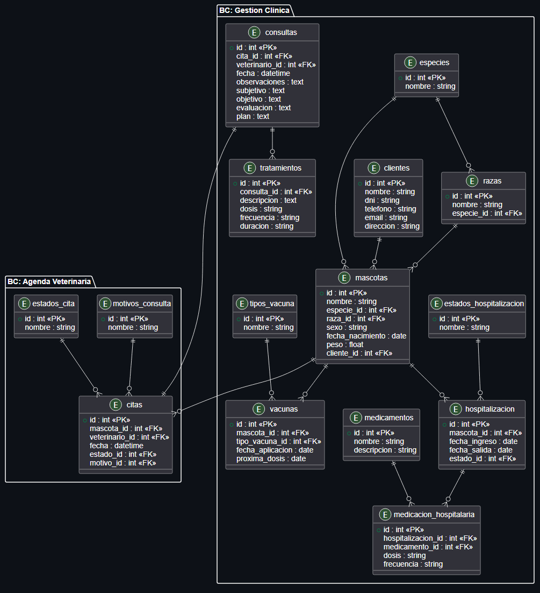

# Capítulo IV: Product Design

---

## 4.1. Style Guidelines

VetCare, dedicado a la gestión eficiente, rápida y confiable del cuidado y salud de las mascotas, transmite calma, confianza, higiene y profesionalismo. Nuestra identidad visual combina colores relacionados al sector salud y cuidado animal para evocar tranquilidad y seguridad en nuestros usuarios, junto a una tipografía clara y espacios limpios. Comunicamos con un lenguaje accesible, empático pero riguroso, transformando procesos médicos y de organización en soluciones prácticas para el bienestar de las mascotas y tranquilidad de sus dueños.

---

### 4.1.1. General Style Guidelines

**Logo:**
El logo de VetCare fusiona elementos del cuidado animal y seguridad en un diseño representativo. Consiste en una silueta estilizada que resguarda una huella de mascota, simbolizando nuestro compromiso con la protección y la salud de los animales. Esta imagen refleja cómo nuestra plataforma conecta tecnología moderna con el bienestar veterinario.

**Typography:**
La tipografía de la página debe ser accesible, limpia y altamente legible para adaptarse a cualquier dispositivo. Se emplea una fuente sans-serif (como Poppins o Roboto) debido a sus trazos modernos y limpios. Esto asegura que la lectura de historias clínicas, datos de citas y perfiles sea cómoda para profesionales y dueños de mascotas.

**Color Guide:**

1. **Deep Navy Blue (#1E293B)** *Representación:* El azul oscuro simboliza profesionalismo, autoridad, seguridad y confianza. Se utiliza para elementos estructurales como barras laterales (sidebars), menús de navegación y texto principal.

  

2. **Vibrant Cyan / Turquoise (#06B6D4)** *Representación:* Evoca salud, frescura, empatía y energía moderna. Es el color principal de interacción (botones de acción, hipervínculos, indicadores de selección).

  

3. **Neutral Light Gray (#F3F4F6)** *Representación:* Transmite neutralidad y equilibrio. Funciona como un ancla visual que relaja la vista, empleándose como color de fondo en la aplicación web y landing page.

  

4. **Pure White (#FFFFFF)** *Representación:* Simboliza higiene clínica y orden. Es utilizado en los contenedores o tarjetas principales donde reside el contenido (perfiles de mascotas, registros clínicos).

  

5. **Light Blue Accent (#E0F2FE)** *Representación:* Color complementario que aporta suavidad al diseño. Usado generalmente en etiquetas (tags) y estados de hover en botones secundarios.

  

### 4.1.2. Web Style Guidelines

Para VetCare, implementaremos un diseño adaptable (**Responsive Web Design**) que optimice la presentación de la información en diversas resoluciones. Incorporaremos patrones de lectura visuales (como el patrón en forma de **Z** o **F**) para dirigir la atención hacia los elementos críticos, como el sistema de reservas y planes de suscripción.

## 4.2. Information Architecture

### 4.2.1. Organization Systems
La información en VetCare se diseña e implementa de manera modular y jerárquica:
- **Dashboard:** Vista centralizada de indicadores clave.
- **Schedule:** Agenda visual para la gestión de citas.
- **Medical Records:** Módulo dedicado a historias clínicas y tratamientos.

### 4.2.2. Labeling Systems
El etiquetado es conciso y familiar para evitar confusiones: "Dashboard", "Schedule", "Communication", "Profile" y "Log Out".

## 4.3. Landing Page UI Design

### 4.3.1. Landing Page Wireframe

  
  
  
  
  
  

### 4.3.2. Landing Page Mock-up

  

## 4.4. Web Applications UX/UI Design

### 4.4.1. Web Applications Wireframes

### 4.4.2. Web Applications Wireflow Diagrams

### 4.4.3. Web Applications Mock-ups

### 4.4.4. Web Applications User Flow Diagrams

## 4.5. Web Applications Prototyping

## 4.6. Domain-Driven Software Architecture

### 4.6.1 Design-Level EventStorming

### 4.6.2. Software Architecture Context Diagram

### 4.6.3. Software Architecture Container Diagrams

### 4.6.4. Software Architecture Components Diagrams

## 4.7. Software Object-Oriented Design

### 4.7.1. Class Diagrams

## 4.8. Database Design

### 4.8.1. Database Diagram
