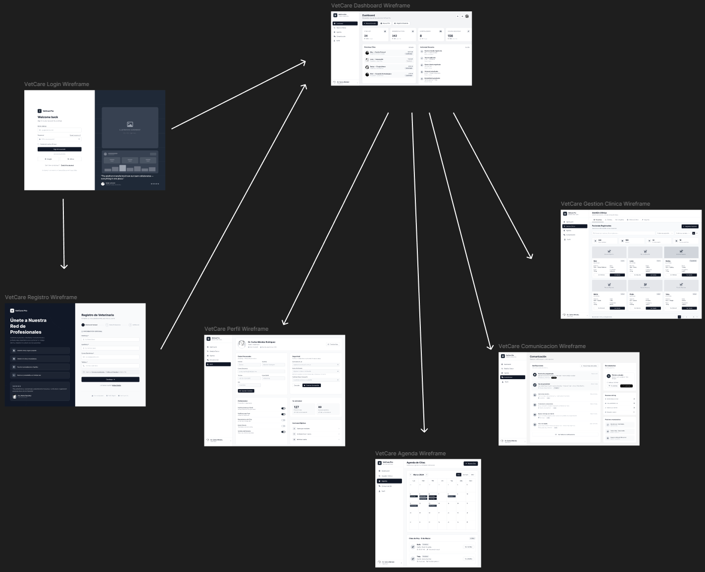
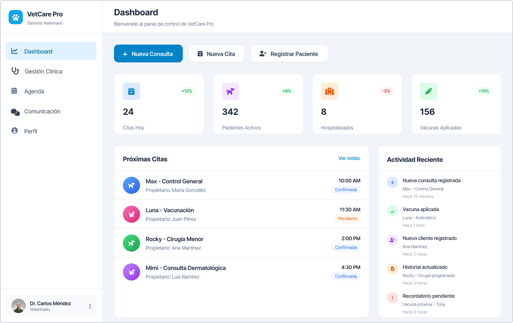
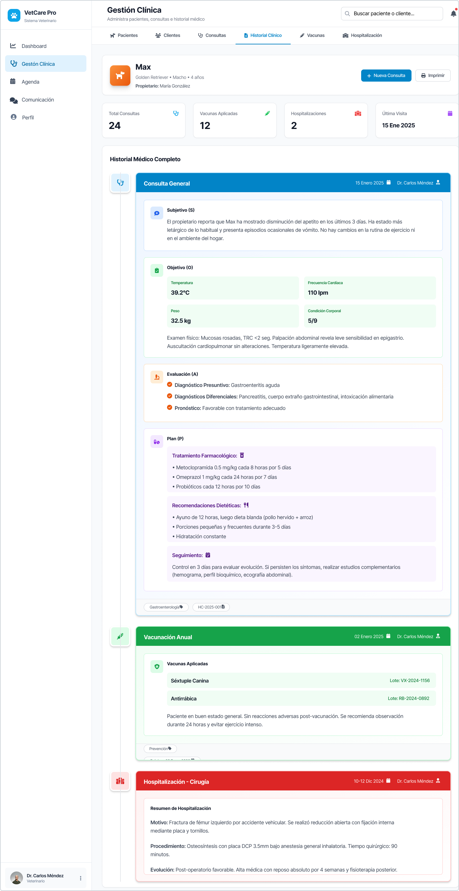
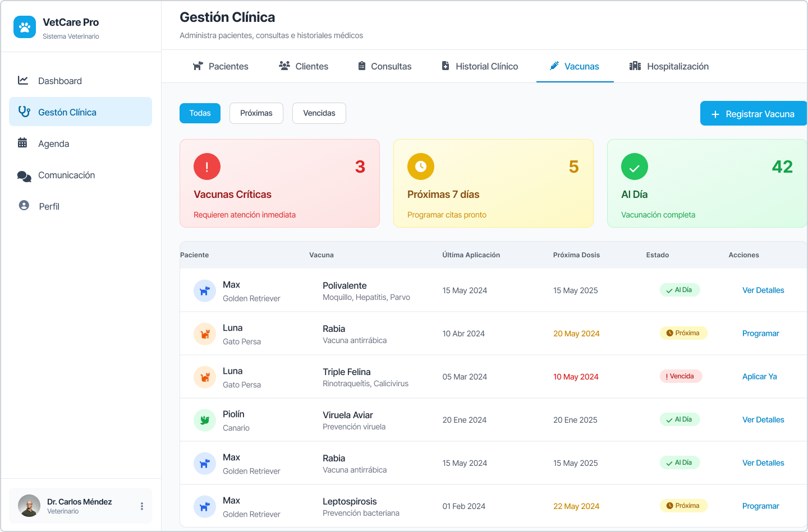
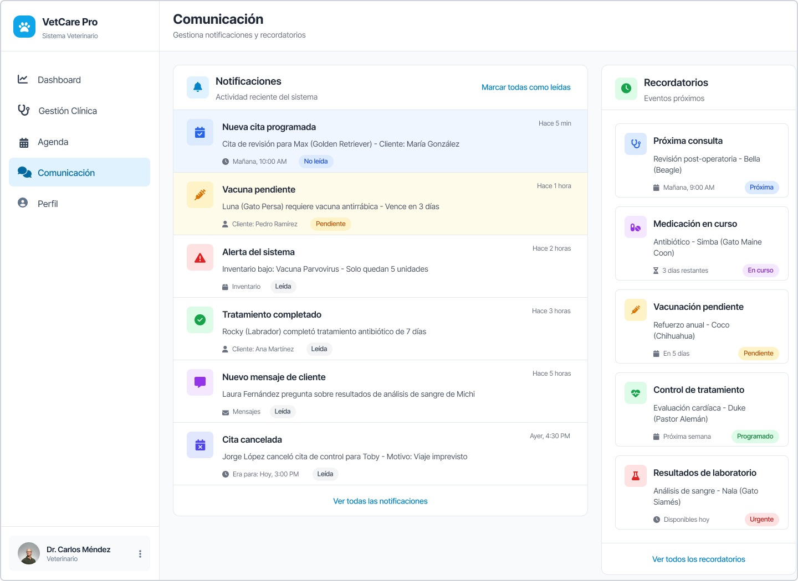
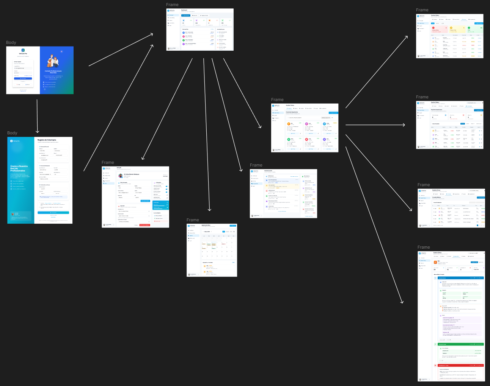
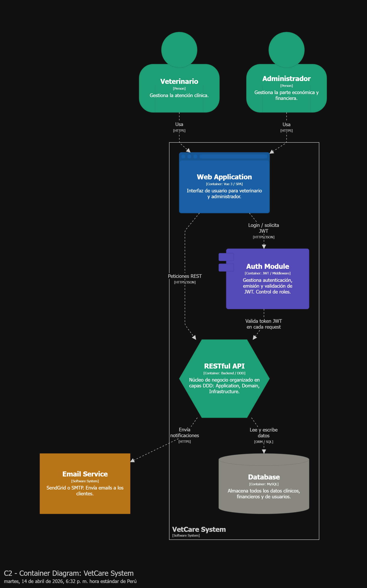
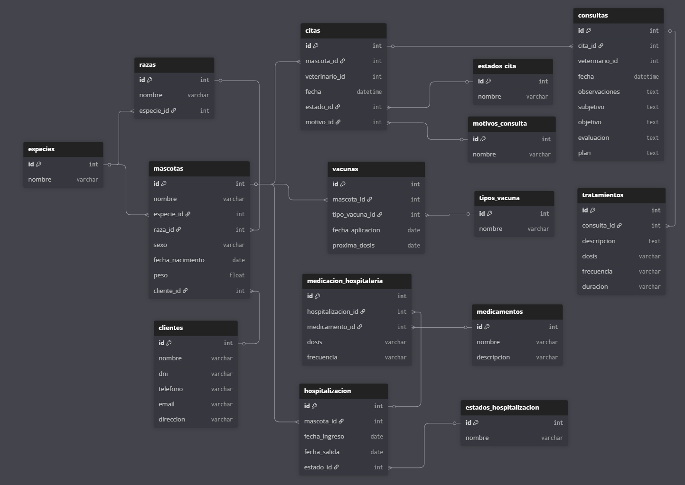

# Capítulo IV: Product Design

---

## 4.1. Style Guidelines

---

### 4.1.1. General Style Guidelines

### 4.1.2. Web Style Guidelines

## 4.2. Information Architecture

---

### 4.2.1. Organization Systems

### 4.2.2. Labeling Systems

### 4.2.3. SEO Tags and Meta Tags

### 4.2.4. Searching Systems

### 4.2.5. Navigation Systems

## 4.3. Landing Page UI Design

---

### 4.3.1. Landing Page Wireframe

### 4.3.2. Landing Page Mock-up

## 4.4. Web Applications UX/UI Design

---

### 4.4.1. Web Applications Wireframes

### 4.4.2. Web Applications Wireflow Diagrams

### 4.4.3. Web Applications Mock-ups

Enlace para acceder a los Mockups en Figma: https://www.figma.com/design/7ZgHbtQwGETyMA1dPqxlX1/Mock-Ups-VetCare?node-id=0-1&t=fc3DNOs4kuDIE58K-1

### 4.4.4. Web Applications User Flow Diagrams

---

## 4.6. Domain-Driven Software Architecture

---

### 4.6.1. Design-Level EventStorming

### 4.6.2. Software Architecture Context Diagram

### 4.6.3. Software Architecture Container Diagrams

### 4.6.4. Software Architecture Components Diagrams

## 4.7. Software Object-Oriented Design

### 4.7.1. Class Diagrams

El diagrama de clases del sistema representa la estructura del módulo de atención veterinaria, mostrando las principales entidades del dominio, sus atributos y las relaciones entre ellas. Este modelo está basado en principios de diseño orientado a objetos y en el enfoque *Domain-Driven Design (DDD)*, donde cada clase representa un concepto clave del negocio.

Las clases principales incluyen **Cliente**, **Mascota**, **Cita**, **Consulta**, **Tratamiento**, **Vacuna** y **Hospitalización**. La clase **Mascota** actúa como una entidad central dentro del dominio clínico, ya que concentra la información médica del paciente. A partir de ella se relacionan las consultas, vacunas y procesos de hospitalización.

La clase **Consulta** representa el núcleo del sistema clínico, ya que almacena la atención médica realizada a la mascota, incluyendo el modelo SOAP (*Subjetivo, Objetivo, Evaluación y Plan*). A su vez, esta clase se relaciona con **Tratamiento**, permitiendo registrar las acciones médicas derivadas.

Por otro lado, la clase **Cita** gestiona la planificación de atenciones, conectando la agenda del veterinario con el proceso clínico. Asimismo, **Hospitalización** permite modelar casos de atención prolongada, incluyendo la administración de medicamentos a través de la clase **MedicacionHospitalaria**.

Las relaciones entre clases reflejan asociaciones uno a muchos, como **Cliente → Mascota**, **Mascota → Consulta**, y **Consulta → Tratamiento**, garantizando una estructura coherente y alineada con el dominio del problema.

---

### 4.7.2. Class Dictionary

**Contexto:** Atención Médica Veterinaria (*Core Domain*)

Este contexto agrupa todas las entidades relacionadas con la atención clínica de las mascotas dentro del sistema.

---

#### Cliente *(Entity)*

**Propósito:** Representa al dueño o tutor de las mascotas.

**Atributos:**
- id  
- nombre  
- dni  
- telefono  
- email  
- direccion  

**Relaciones:**
- Un cliente puede tener múltiples mascotas.

---

#### Mascota *(Entity - Aggregate Root)*

**Propósito:** Representa al paciente del sistema veterinario.

**Atributos:**
- id  
- nombre  
- especie  
- raza  
- sexo  
- fecha_nacimiento  
- peso  

**Relaciones:**
- Pertenece a un cliente.  
- Tiene múltiples citas, consultas, vacunas y hospitalizaciones.

---

#### Cita *(Entity)*

**Propósito:** Gestiona la programación de atenciones veterinarias.

**Atributos:**
- id  
- fecha  
- estado  
- motivo  

**Relaciones:**
- Asociada a una mascota.  
- Puede generar una consulta.

---

#### Consulta *(Entity - Core)*

**Propósito:** Representa la atención médica realizada.

**Atributos:**
- id  
- fecha  
- observaciones  
- subjetivo  
- objetivo  
- evaluacion  
- plan  

**Relaciones:**
- Asociada a una cita.  
- Tiene múltiples tratamientos.

---

#### Tratamiento *(Entity)*

**Propósito:** Define las acciones médicas indicadas en una consulta.

**Atributos:**
- id  
- descripcion  
- dosis  
- frecuencia  
- duracion  

**Relaciones:**
- Pertenece a una consulta.

---

#### Vacuna *(Entity)*

**Propósito:** Registra las vacunas aplicadas a la mascota.

**Atributos:**
- id  
- fecha_aplicacion  
- proxima_dosis  

**Relaciones:**
- Asociada a una mascota.

---

#### Hospitalización *(Entity)*

**Propósito:** Gestiona el internamiento de la mascota.

**Atributos:**
- id  
- fecha_ingreso  
- fecha_salida  
- estado  

**Relaciones:**
- Asociada a una mascota.  
- Tiene múltiples registros de medicación.

---

#### MedicacionHospitalaria *(Entity)*

**Propósito:** Controla los medicamentos administrados durante la hospitalización.

**Atributos:**
- id  
- dosis  
- frecuencia  

**Relaciones:**
- Asociada a hospitalización.  
- Referencia a medicamento.

---

#### Value Objects (VO)

- **EstadoCita:** pendiente, atendido, cancelado  
- **EstadoHospitalizacion:** crítico, estable, alta  
- **TipoVacuna:** catálogo de vacunas  
- **Medicamento:** catálogo de medicamentos  

---

## 4.8. Database Design

### 4.8.1. Database Diagram

El diagrama de base de datos representa la estructura lógica del sistema veterinario, diseñado bajo los principios de normalización hasta la Tercera Forma Normal (3FN), garantizando la eliminación de redundancias y la integridad de los datos.

El modelo está compuesto por entidades principales como **clientes**, **mascotas**, **citas**, **consultas**, **tratamientos**, **vacunas** y **hospitalización**, junto con tablas auxiliares o catálogos como **especies**, **razas**, **estados_cita**, **estados_hospitalizacion**, **tipos_vacuna** y **medicamentos**.

Las relaciones entre tablas se establecen mediante claves foráneas, destacando asociaciones uno a muchos como **cliente → mascotas**, **mascota → citas**, y **consulta → tratamientos**. Asimismo, se incorporan tablas intermedias como **medicacion_hospitalaria** para modelar relaciones más complejas.

El diseño asegura que cada atributo depende únicamente de su clave primaria, evitando dependencias parciales o transitivas, cumpliendo así con las tres formas normales. Además, el uso de tablas de catálogo permite mantener consistencia en los datos y facilita la escalabilidad del sistema.

Este modelo está alineado con el enfoque *Domain-Driven Design (DDD)*, donde cada tabla representa una entidad del dominio, permitiendo una integración eficiente con la capa de aplicación y presentación del sistema.

