# Capítulo V: Product Implementation, Validation & Deployment

En esta sección se mencionan las decisiones y convenciones las cuales permitirán mantener una consistencia durante el desarrollo del proyecto.

---

## 5.1. Software Configuration Management

---

### 5.1.1. Software Development Environment Configuration

**Project Management:**

La gestión de los proyectos tiene como objetivo mejorar los procesos y su entorno para alcanzar los resultados esperados.

* **Trello:** Es una herramienta visual que permite gestionar cualquier tipo de proyecto y el flujo de trabajo que el equipo desarrollador seguirá para implementar correctamente las tareas de código para el Landing Page y el Web Application.
  | Link de referencia: | https://trello.com/es |
  | --- | --- |

* **Pivotal Tracker:** Esta herramienta se define como una plataforma en la que se realiza la gestión de user stories, agrupándolos en epics y clasificando su presencia en el programa, por puntaje. Permite que cada miembro del equipo comparta la misma vista en tiempo real de lo que está sucediendo.
  | Link de referencia: | https://www.pivotaltracker.com/ |
  | --- | --- |

**Product UX/UI Design:**

Nos permite desarrollar el modelo en nuestro producto de manera digital y forme parte de la vida del consumidor. En este caso realizar un modelo de sitio web para computadoras y celulares.

* **Uxpressia:** Es una herramienta en línea para el mapeo de la trayectoria del cliente que crea mapas de impacto y personas. Sus herramientas nos permitieron establecer las bases del modelado de User Persona, Empathy Map y Journey Map.
  | Link de referencia: | https://uxpressia.com/ |
  | --- | --- |

* **MIRO:** Es una pizarra digital colaborativa en línea, que puede ser usada para la investigación, la ideación, la creación de lluvias de ideas, mapas mentales y una variedad de otras actividades colaborativas.
  | Link de referencia: | https://www.miro.com/ |
  | --- | --- |

* **Figma:** Es una herramienta de prototipo web y editor de gráficos vectorial alojada en la web, que permite establecer los modelos para las versiones de Web Browser y Landing Page.
  | Link de referencia: | https://www.figma.com/ |
  | --- | --- |

* **LucidChart:** Es una herramienta de diagramación basada en la web, que permite colaborar en tiempo real creando diseños UML, mapas mentales, prototipos de software, entre otros.
  | Link de referencia: | https://www.lucidchart.com |
  | --- | --- |

* **Structurizr:** Es una herramienta de diseño que soporta el modelo C4 para visualizar la arquitectura de software de nuestra solución.
  | Link de referencia: | https://structurizr.com/ |
  | --- | --- |

**Software Development:**

Es una estructura aplicada al desarrollo de un producto de software. Se utiliza para el establecimiento de un proceso para el desarrollo de software, cada uno de los cuales describe un enfoque diferente para diferentes actividades que tienen lugar durante el proceso.

* **GitHub:** Es un repositorio comunitario cuya función es almacenar los avances de un proyecto elaborado por un grupo de personas.
  | Link de referencia: | https://github.com/ |
  | --- | --- |

* **WebStorm:** Es un entorno de JetBrains. Este nos ofrece facilidad en probar nuestro entorno web en navegadores web.
  | Link de referencia: | https://www.jetbrains.com/webstorm/ |
  | --- | --- |

* **HTML:** Es un lenguaje que sirve como desarrollador de plataformas web que trabaja con hipertextos.
  | Link de referencia: | https://www.jetbrains.com/help/webstorm/editing-html-files.html |
  | --- | --- |

* **CSS:** Es un lenguaje de diseño para el entorno web. Permite elaborar la interfaz de usuario diseñada anteriormente.
  | Link de referencia: | https://www.jetbrains.com/help/webstorm/style-sheets.html#ws_css_completion |
  | --- | --- |

* **JavaScript:** Es un lenguaje de programación ligero, interpretado o compilado justo a tiempo (JIT) con funciones de primera clase, esencial para el desarrollo de aplicaciones web interactivas.
  | Link de referencia: | https://developer.mozilla.org/es/docs/Web/JavaScript |
  | --- | --- |

* **Vue.js:** Framework progresivo de JavaScript utilizado para construir interfaces de usuario y aplicaciones de una sola página (SPA).
  | Link de referencia: | https://vuejs.org/ |
  | --- | --- |

* **GitHub Pages:** Servicio de Github que nos permitió alojar nuestra landing page y nos permitirá alojar nuestras web applications.
  | Link de referencia: | https://pages.github.com/ |
  | --- | --- |

**Software Testing:**

Es el acto de examinar los artefactos y el comportamiento del software bajo prueba mediante validación y verificación.

* **Lenguaje Gherkin:** Es un DSL o Lenguaje Específico de Dominio, es decir, un lenguaje que está creado para resolver un problema. Se pueden agregar los user stories del programa con sus respectivas partes: Feature, Scenario, Example, Scenario Outline, Given, When, Then y And.

### 5.1.2. Source Code Management

En esta sección se presenta la gestión de código fuente o como es conocido por sus siglas en inglés SCM (Source Code Management). Su función principal es realizar un seguimiento de las modificaciones que el equipo realizará a lo largo del desarrollo de sus proyectos en los repositorios de código fuente. Se emplea como un sistema de control de versiones que permite dar seguimiento a los cambios que cada integrante o desarrollador realice en el proyecto. Asimismo, cabe resaltar que para el sistema de control de versiones emplearemos GitHub.

**GitFlow**

Es el modelo alternativo de creación de ramas en Git que en los últimos años se ha vuelto una herramienta indispensable para muchos desarrolladores. Este flujo de trabajo de control de versiones utiliza ramas y fue publicado y popularizado por Vincent Driessen. Su principal función es ayudar en la organización de la versión de un código, permitiendo la creación de nuevos Features y Hotfixes de manera organizada.

**Main Branches:**

* **main:** es la rama principal, a partir de ella se recorrerán todas las ramas y contendrá la última versión y las anteriores creadas por los desarrolladores.
* **Develop:** Esta rama puede ser creada a partir de la rama main (master) y contará con todos los Features estables. Esto significa que a través de esta rama el equipo podrá integrar las funciones.

**Support Branches:**

* **Feature:** se ramifica de develop y al finalizar debe fusionarse de nuevo en develop. Se emplea para desarrollar nuevas funciones que se integrarán en versiones posteriores.
* **Release:** también se ramifica de develop, es la rama que admite la preparación de una nueva versión de producción.
* **Hotfix:** también está destinado a una nueva versión de producción, pero esta se ramifica de main. Su función es reparar rápidamente las publicaciones de producción.

**Conventional Commits:**

Son una convención para nombrar mensajes de commit en Git de forma estructurada, clara y semántica.

* **feat:** Se añade una nueva funcionalidad.
* **fix:** Se corrige un error.
* **docs:** Cambios en la documentación.
* **style:** Cambios de formato o estilo de código (sin impacto en la lógica).
* **refactor:** Mejoras en el código que no añaden nuevas funcionalidades ni corrigen errores.
* **test:** Añadir o modificar tests.
* **chore:** Cambios menores sin impacto en el código de producción (actualización de dependencias, configuración, etc.).

### 5.1.3. Source Code Style Guide & Conventions

El equipo ha definido un conjunto de reglas y estándares de programación con el objetivo de garantizar la legibilidad, mantenibilidad y coherencia del código en el proyecto Vetalis. Como regla transversal y obligatoria, toda la nomenclatura de los elementos del sistema se realizará en el idioma inglés.

#### General Naming Conventions

Se adoptan las convenciones de capitalización estándar para diferenciar la naturaleza de los componentes:

* **PascalCase:** Utilizado para nombres de clases, interfaces, métodos y propiedades en C#.
* **camelCase:** Utilizado para variables locales, parámetros de métodos y variables en JavaScript.
* **kebab-case:** Utilizado para nombres de archivos, selectores CSS (IDs y clases) y nombres de componentes en el DOM de HTML.

#### HTML & CSS Style Guide

Basado en la Google HTML/CSS Style Guide y las directrices de la W3C:

* **HTML:** Uso obligatorio de etiquetas semánticas para mejorar el SEO y la accesibilidad. Se requiere una indentación de 2 espacios y el uso de comillas dobles para los atributos.
* **CSS:** Se prioriza el uso de selectores de clase. Las propiedades deben agruparse de manera lógica (posicionamiento, luego modelo de caja, luego tipografía). Se prohíbe el uso de estilos en línea (inline styles).

#### JavaScript & Vue.js Style Guide

Siguiendo la Google JavaScript Style Guide, MDN Guidelines y la Vue Style Guide:

* **Sintaxis:** Uso de ES6+ (Arrow functions, destructuring y template literals). Se prefiere `const` para todas las declaraciones, usando `let` solo cuando sea estrictamente necesario.
* **Vue.js:** Los nombres de los componentes deben seguir la convención de múltiples palabras (Multi-word component names) para evitar conflictos con elementos HTML estándar.

#### C# & ASP.NET Core Coding Conventions

Siguiendo las Microsoft C# Coding Conventions y las guías de ASP.NET Core:

* **Estructura:** Las interfaces deben comenzar con el prefijo "I". Los campos privados deben utilizar el prefijo de guion bajo (`_camelCase`).
* **Asincronía:** Se debe implementar el patrón Task-based Asynchronous Pattern (TAP), añadiendo el sufijo `Async` a todos los métodos que retornen un `Task`.

#### Gherkin Conventions for Readable Specifications

Para la redacción de criterios de aceptación y pruebas de comportamiento:

* **Formato:** Uso riguroso de la estructura `Given / When / Then`.
* **Lenguaje:** Las especificaciones deben redactarse desde la perspectiva del negocio (usuario de la veterinaria), evitando tecnicismos de implementación en los pasos de Gherkin.

#### Referencias de Estándares Adoptados

| Tecnología | Referencia Principal |
| :--- | :--- |
| HTML / CSS | Google HTML/CSS Style Guide / W3C |
| JavaScript | Google JS Style Guide / MDN |
| C# | Microsoft C# Coding Conventions |
| ASP.NET Core | Microsoft ASP.NET Core Coding Guidelines |
| Vue.js | Vue Style Guide (Priority A) |
| Gherkin | Gherkin Conventions for Readable Specifications |
### 5.1.4. Software Deployment Configuration

Como se mencionó previamente, la gestión de nuestro código fuente se realizará a través de GitHub. Asimismo, se utilizará GitHub Pages para la publicación y despliegue de la página.

Para el desarrollo del Landing Page de NeuroZen se han usado las siguientes herramientas:

* **HTML:** lenguaje con el cual está estructurado nuestro landing page.
* **CSS:** diseño y formato para el html desarrollado.

El despliegue de nuestro landing page es posible gracias a la herramienta de Github Pages. El cual es un servicio que nos permite alojar nuestro landing directamente desde el repositorio de GitHub.

Para lograr el despliegue seguimos los siguientes pasos:

1. Dirigirnos al repositorio de la página y entrar en la sección de configuración.
2. Ir a la opción de “Pages”, donde se encontrarán todas las opciones de publicación de página.
3. Se debe seleccionar la rama la cual se va a publicar en el vínculo. También se debe seleccionar la carpeta donde se localizara la publicación.
4. Finalmente, el link vínculo de nuestra página aparecerá en la parte superior.

## 5.2. Landing Page, Services & Applications Implementation

La construcción de la página de inicio, junto con los servicios y aplicaciones, es un paso fundamental en nuestro ciclo de desarrollo. Esto nos permite hacer realidad el diseño y las funciones proyectadas, convirtiendo las ideas iniciales en productos tangibles y listos para su uso. En esta fase traducimos los requerimientos y especificaciones a código fuente, estructurando la plataforma web según las necesidades detectadas.

---

### 5.2.1. Sprint 1

El primer sprint marca un hito crucial en nuestro proceso de desarrollo ágil. A lo largo de esta fase, concentraremos nuestros esfuerzos en la implementación de las herramientas y características de mayor prioridad definidas durante la planificación. Esto conlleva transformar los requerimientos técnicos en código funcional, sentando así las bases de nuestro producto a través de un enfoque totalmente iterativo.

#### 5.2.1.1. Sprint Planning 1

| Sprint # | Sprint 1                                                                                                                                                                                                                                                                                                                                                                                                                                           |
| :--- |:---------------------------------------------------------------------------------------------------------------------------------------------------------------------------------------------------------------------------------------------------------------------------------------------------------------------------------------------------------------------------------------------------------------------------------------------------|
| **Sprint Planning Background** |                                                                                                                                                                                                                                                                                                                                                                                                                                                    |
| **Date** | 2026-04-17                                                                                                                                                                                                                                                                                                                                                                                                                                         |
| **Time** | 07:00 PM                                                                                                                                                                                                                                                                                                                                                                                                                                           |
| **Location** | Google Meet (Reunión virtual)                                                                                                                                                                                                                                                                                                                                                                                                                      |
| **Prepared By** | Sejuro Medina, Mario Gabriel                                                                                                                                                                                                                                                                                                                                                                                                                       |
| **Attendees (to planning meeting)** | Nuñez Soto, Andy Arturo / Roman Zevallos, Sebastian Jared / Romero Vilela, Dario Alberto / Sanchez Benavente, Leonardo Matias / Sejuro Medina, Mario Gabriel                                                                                                                                                                                                                                                                                       |
| **Sprint 1 – 1 Review Summary** | Se alcanzaron los objetivos del producto como la realización de todos los capítulos, el despliegue completo de la Landing Page y la mayoría de información necesaria dentro del reporte, sin embargo, una de las tareas/objetivos más importantes que se debía alcanzar fue la presentación de un informe en formato pdf y word.                                                                                                                   |
| **Sprint 1 – 1 Retrospective Summary** | El sprint 1 fue un poco menos productivo de lo esperado. El producto resultante no es perfecto, pero sí es funcional. Debemos realizar una mejor coordinación para los futuros trabajos.                                                                                                                                                                                                                                                           |
| **Sprint Goal & User Stories** |                                                                                                                                                                                                                                                                                                                                                                                                                                                    |
| **Sprint 1 Goal** | Para este sprint se requiere el cumplimiento de los siguientes objetivos: Finalización de reporte y despliegue sin problemas de la Landing Page que se encuentran en nuestro repositorio. La métrica de cumplimiento se basará en el proceso de cómo nuestro "Board de Trello" luzca con el paso del tiempo, nuestro resultado final debe de mostrar todas las tareas en el lado derecho de la herramienta, ubicándolos en la columna "Terminado". |
| **Sprint 1 Velocity** | 20                                                                                                                                                                                                                                                                                                                                                                                                                                                 |
| **Sum of Story Points** | 20                                                                                                                                                                                                                                                                                                                                                                                                                                                 |

La sesión de Sprint Planning es clave dentro de la metodología ágil, ya que en ella el equipo organiza con detalle las actividades de la siguiente iteración. Aquí se determinan las tareas a realizar, los tiempos estimados y los responsables. Su objetivo principal es trazar una hoja de ruta definida y realista, promoviendo el trabajo en equipo y garantizando que todos compartan la misma visión sobre las metas trazadas.

#### 5.2.1.2. Aspect Leaders and Collaborators

En la primera iteración (Sprint 1), el equipo concentró sus esfuerzos en la implementación de la **Landing Page**, correspondiente al **Epic 1: Landing Page (Static Web Site)**. El objetivo principal fue establecer la presencia digital de **VetCare** y validar la estructura base de navegación y captación de leads.

**Historias de Usuario Abordadas**

| ID | Título | Descripción | Estimación (Horas) | Asignado a | Estado |
| :--- | :--- | :--- |:------------------:| :--- | :---: |
| **US001** | View Value Proposition | Como visitante, quiero leer la propuesta de valor principal en la página de inicio para entender qué ofrece el software. |         3          | Nuñez Soto, Andy Arturo | Done |
| **US002** | Select Veterinarian Segment | Como veterinario, quiero acceder a la sección de funciones clínicas para evaluar las herramientas relevantes para mi práctica. |         5          | Roman Zevallos, Sebastian Jared | Done |
| **US003** | Request Software Demo | Como administrador, quiero enviar un formulario de contacto para solicitar una demostración del sistema. |         4          | Romero Vilela, Dario Alberto | Done |
| **US004** | View Pricing Plans | Como visitante, quiero visualizar los planes de suscripción para evaluar el costo financiero del software. |         3          | Sanchez Benavente, Leonardo Matias | Done |
| **US006** | Read Client Testimonials | Como visitante, quiero leer testimonios de otras clínicas para generar confianza en el producto. |         4          | Sejuro Medina, Mario Gabriel | Done |
| **US007** | Subscribe to Newsletter | Como visitante, quiero suscribirme al boletín informativo para recibir actualizaciones y consejos de gestión. |         2          | Sanchez Benavente, Leonardo Matias | Done |

Evidencia del avance en Trello:

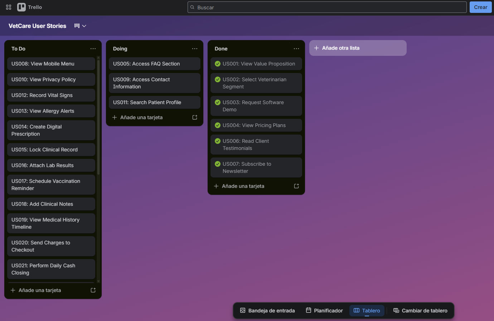

**Enlace de Trello:** https://trello.com/invite/b/6917adb24db7620443624f0e/ATTI85cc7a18b5b39f3d16f5326d772e99912ECEDAEC/vetcare-user-stories

Este Sprint permitió entregar la Landing Page inicial de VetCare, proporcionando a los visitantes un primer acercamiento a la propuesta de valor, las herramientas de gestión para administradores, las funcionalidades clínicas para veterinarios, testimonios del sector e información general de la aplicación.

#### 5.2.1.3. Sprint Backlog 1

| Sprint # | Sprint 1 |
| :--- | :--- |

| User Story / Task Id | Title | Description | Estimation (Hours) | Assigned To | Status |
| :--- | :--- | :--- |:------------------:| :--- | :---: |
| **WK01** | Development environment setup | Configuration of GitHub organization, branch strategy, and Trello board. |         2          | All team members | Done |
| **WK02** | Complete Chapter 01 | Finalizing Startup Profile, Solution Profile, and team organization. |         4          | All team members | Done |
| **WK03** | Complete Chapter 02 | Documentation of User Personas, Empathy Maps, and Requirements Elicitation. |         6          | All team members | Done |
| **WK04** | Complete Chapter 03 | Specification of User Stories, Impact Mapping, and Product Backlog. |         6          | All team members | Done |
| **WK05** | Complete Chapter 04 | **Extensive Design Phase:** Style guidelines, UX/UI Mockups (Wireframes & Hi-Fi), and Database Design. |         9          | All team members | Done |
| **WK06** | Complete Chapter 05 | **Implementation Setup:** Documentation of SCM, environment setup, and deployment evidence. |         8          | All team members | Done |
| **US001** | View Value Proposition | As a visitor, I want to read the main value proposition of VET-Smart on the home page. |         3          | Nuñez Soto, Andy Arturo | Done |
| **US002** | Select Veterinarian Segment | As a visitor of the veterinarian segment, I want to access a specific section detailing clinical features. |         5          | Roman Zevallos, Sebastian Jared | Done |
| **US003** | Request Software Demo | As a visitor of the administrator segment, I want to submit a contact form to request a software demo. |         4          | Romero Vilela, Dario Alberto | Done |
| **US004** | View Pricing Plans | As a visitor, I want to view the available subscription plans to evaluate the financial cost. |         3          | Sanchez Benavente, Leonardo Matias | Done |
| **US006** | Read Client Testimonials | As a visitor, I want to read testimonials from current clinics to build trust in the product. |         4          | Sejuro Medina, Mario Gabriel | Done |
| **US007** | Subscribe to Newsletter | As a visitor, I want to subscribe to the newsletter to receive updates and tips. |         2          | Sanchez Benavente, Leonardo Matias | Done |

#### 5.2.1.4. Development Evidence for Sprint Review

En esta sección se explica y presenta los avances en implementación con relación a los productos de la solución según el alcance del Sprint: Landing Page, Web Applications y Web Services.

Primero, se mostrarán los commits más importantes para el Reporte, los cuales muestran el ciclo de vida del proyecto y toda la información que se usó, usa y usará para el desarrollo del proyecto:

| Repository | Branch | Commit Message | Commit ID |
| :--- | :---: | :--- | :---: |
| /Report | develop | docs(chapter-01): add Lean UX Canvas section to solution profile | c936c17 |
| /Report | develop | feat(chapter03): add user stories and impact mapping | c202c92 |
| /Report | develop | docs: update chapter-04 Style Guidelines, Information Architecture and UI Design | eb0ae31 |

**Commits de Documentación y Diseño**

| Autor | Fecha | Commit Message | Commit ID |
| :--- | :---: | :--- | :---: |
| Sanchez Benavente, Leonardo Matias | 16/04/2026 | docs: añade segmentos objetivo en chapter-01 | 5242c30 |
| Roman Zevallos, Sebastian Jared | 16/04/2026 | docs(chapter-03): remove emojis from user story titles | e54f0ed |
| Nuñez Soto, Andy Arturo | 17/04/2026 | Update chapter-04.md | bdef246 |
| Sejuro Medina, Mario Gabriel | 17/04/2026 | docs(chapter-02): Added Journey map titles | 9ad00b3 |
| Romero Vilela, Dario Alberto | 17/04/2026 | "Chapter 2 (empathy-map): add veterinarian empathy map image and analysis" | 9104551 |
| Sanchez Benavente, Leonardo Matias | 17/04/2026 | docs: update section 5.2 landing page and sprint 1 descriptions | 392c5fd |
| Sejuro Medina, Mario Gabriel | 20/04/2026 | docs(chapter-05): updated Sprint Backlog 1 | 64886d1 |
| Roman Zevallos, Sebastian Jared | 20/04/2026 | docs(chapter-05): updated software development | 7230556 |
| Romero Vilela, Dario Alberto | 20/04/2026 | "docs (Chapter-02): add big picture event storming and color legend" | dd2b3db |
| Nuñez Soto, Andy Arturo | 19/04/2026 | Add files via upload (Chapter 04 assets) | d54684d |

#### 5.2.1.5. Execution Evidence for Sprint Review
Durante el Sprint 1 se llevaron a cabo las actividades de diseño, desarrollo e implementación de las principales secciones de la landing page. Estas secciones permiten a los usuarios obtener información clara y estructurada sobre la startup y el producto ofrecido. A continuación, se presentan las evidencias correspondientes al trabajo realizado.

#### 5.2.1.6. Services Documentation Evidence for Sprint Review

Durante el Sprint 1 se elaboró la documentación funcional de la *landing page* correspondiente a la plataforma de optimización energética. Esta documentación describe las principales secciones implementadas, así como los servicios y funcionalidades disponibles para el usuario final.

### 1. Información General del Producto

En primer lugar, se definió la sección de **información general del producto**, orientada a proporcionar a los visitantes una comprensión clara del propósito de la plataforma y de los beneficios asociados a la reducción del consumo energético y el ahorro en costos.

### 2. Funcionalidades Principales

Asimismo, se documentaron las funcionalidades principales del sistema, tales como:

- Monitoreo en tiempo real  
- Generación de reportes energéticos  
- Envío de alertas para optimizar el consumo en el hogar  

### 3. Recomendaciones de Ahorro Energético

Adicionalmente, se incluyó una sección de **recomendaciones de ahorro energético**, en la cual se presentan buenas prácticas para el uso eficiente de dispositivos y la mejora de hábitos de consumo.

### 4. Testimonios y Casos de Éxito

La documentación también contempla la incorporación de **testimonios y casos de éxito**, con el objetivo de reforzar la credibilidad del producto mediante evidencia de resultados reales obtenidos por usuarios o entidades.

### 5. Planes y Precios

Por otro lado, se especificó la sección de **planes y precios**, donde se detallan las distintas opciones disponibles:

- Básico  
- Pro  
- Empresarial  

Cada plan incluye sus respectivas características y beneficios asociados.

### 6. ¿Cómo Funciona?

De igual manera, se documentó la sección **“¿Cómo funciona?”**, la cual explica de forma clara y estructurada el flujo de uso de la plataforma, desde la creación de una cuenta hasta la obtención de reportes de consumo energético.

### 7. Aspectos Técnicos y de Usabilidad

Finalmente, se consideraron aspectos técnicos y de usabilidad, tales como:

- Implementación de un formulario de contacto para la comunicación con el equipo de soporte  
- Verificación del correcto funcionamiento de los componentes interactivos  
- Adaptabilidad a dispositivos móviles (*responsive design*)  
- Inclusión de llamadas a la acción (*CTA*) estratégicamente ubicadas en la interfaz
  
#### 5.2.1.7. Software Deployment Evidence for Sprint Review

Para el despliegue de la *landing page* del proyecto **VetCare**, se utilizó **GitHub Pages** como plataforma de publicación, permitiendo que la aplicación sea accesible de manera pública a través de la web.

El proceso de despliegue fue automatizado mediante el uso de la herramienta **angular-cli-ghpages (v3.0.2)**, integrada dentro del flujo de trabajo del proyecto Angular. Para facilitar este procedimiento, se configuró un script en el archivo `package.json`, el cual permite ejecutar el despliegue mediante un único comando.

El comando utilizado fue:

npm run deploy

A continuación, se proporciona el enlace a la *landing page* desplegada: https://1asi0730-2610-17953-g3-vetcare.github.io/VetCare-Landing-Page/

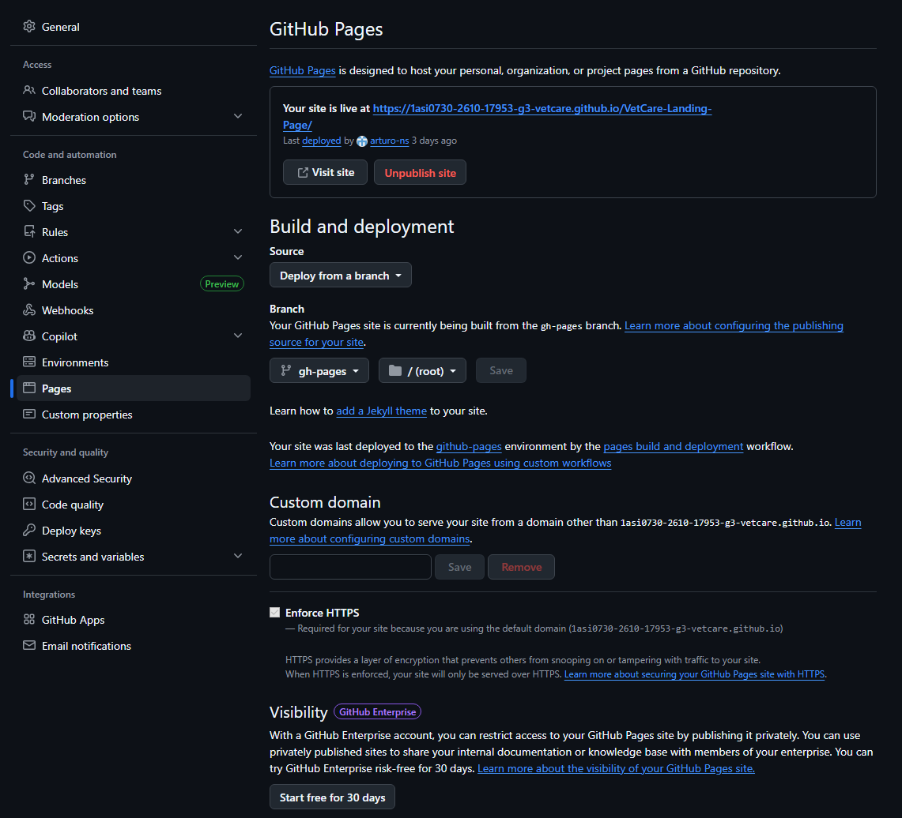

#### 5.2.1.8. Team Collaboration Insights during Sprint

Durante el desarrollo del sprint, se emplearon herramientas como **WebStorm** y **Git** para facilitar la colaboración y gestión del código fuente entre los miembros del equipo.

La *landing page* fue dividida en diferentes secciones, las cuales fueron asignadas de manera individual a cada integrante del equipo. Esta estrategia permitió un desarrollo paralelo, optimizando el tiempo y mejorando la productividad del grupo.

Finalmente, un miembro del equipo asumió la responsabilidad de integrar todas las contribuciones, consolidando el producto final y asegurando la coherencia funcional y visual de la aplicación.

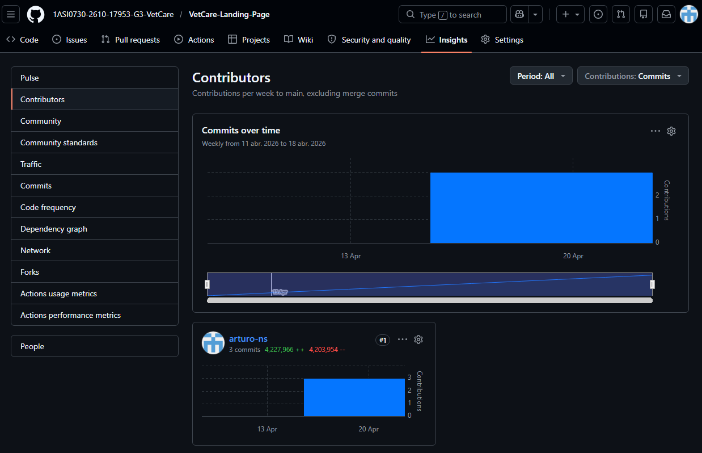

### 5.2.2. Sprint 2

La segunda iteración representa un avance estratégico en el desarrollo de **Vetalis**. Durante este periodo, el equipo enfocó su capacidad operativa en la construcción y despliegue de la aplicación web frontend, priorizando las interfaces de gestión clínica y la arquitectura basada en componentes de **Angular**. Este proceso consistió en traducir los requisitos de experiencia de usuario en componentes visuales operativos, expandiendo los cimientos funcionales hacia una solución interactiva.

#### 5.2.2.1. Sprint Planning 2

| Sprint # | Sprint 2 |
| :--- | :--- |
| **Sprint Planning Background** | Sesión de planificación enfocada en la configuración y desarrollo del frontend, asignando tareas para los módulos clínicos. |
| **Date** | 2026-05-11 |
| **Time** | 05:00 PM |
| **Location** | Google Meet (Reunión virtual) |
| **Prepared By** | Nuñez Soto, Andy Arturo |
| **Attendees** | Nuñez Soto, Andy Arturo / Roman Zevallos, Sebastian Jared / Romero Vilela, Dario Alberto / Sanchez Benavente, Leonardo Matias / Sejuro Medina, Mario Gabriel |
| **Sprint 1 Review Summary** | Se logró implementar y desplegar con éxito la Landing Page estática. Se validó la presentación de la propuesta de valor y planes ante el Product Owner. |
| **Sprint 1 Retrospective Summary** | Se identificó que la comunicación vía GitFlow fue fluida, pero se acordó mejorar la estimación de tiempos en diseño responsivo. |
| **Sprint Goal** | Desplegar el frontend de gestión clínica para facilitar el manejo de triajes e historiales médicos mediante una aplicación interactiva en Angular. |
| **Sprint 2 Velocity** | 34 |
| **Sum of Story Points** | 34 |

#### 5.2.2.2. Aspect Leaders and Collaborators

Durante la ejecución de la segunda iteración, el equipo focalizó sus capacidades en el desarrollo y estructuración de la aplicación web frontend, abordando los requerimientos priorizados dentro del **Epic 2: Clinical Management - EHR (Veterinarian)**. La finalidad de este ciclo fue consolidar las interfaces operativas de la plataforma y habilitar los módulos interactivos para optimizar el flujo de trabajo de los profesionales veterinarios.

| Team Member (Last Name, First Name) | GitHub Username | Configuración y Despliegue Frontend Leader (L) / Collaborator (C) | Módulo de Búsqueda y Alertas Leader (L) / Collaborator (C) | Módulo de Historial y Recetas Leader (L) / Collaborator (C) | Módulo de Triaje Leader (L) / Collaborator (C) |
| :--- |:----------------| :---: | :---: | :---: | :---: |
| Nuñez Soto, Andy Arturo | arturo-ns       | L | C | C | C |
| Roman Zevallos, Sebastian Jared | Chebas19        | C | C | L | C |
| Romero Vilela, Dario Alberto | patatitis9-alt  | C | C | L | C |
| Sanchez Benavente, Leonardo Matias | Matiassb06      | C | C | C | L |
| Sejuro Medina, Mario Gabriel | maghetthi       | C | L | C | C |

#### 5.2.2.3. Sprint Backlog 2

| Sprint # | Sprint 2 |
| :--- | :--- |

| User Story / Task Id | Title | Description | Estimation (Hours) | Assigned To | Status |
| :--- | :--- | :--- | :---: | :--- | :---: |
| **WK07** | Configuración y Despliegue del Frontend | Configuración del entorno de desarrollo en Angular y despliegue de la aplicación en GitHub Pages para generar la URL pública. | 5 | Todos los miembros | Done |
| **US012** | Record Vital Signs | Implementación del formulario para el registro de peso y temperatura durante el proceso de triaje médico. | 5 | Sanchez Benavente, Leonardo Matias | Done |
| **US013** | View Allergy Alerts | Implementación visual de banners de alta prioridad en la vista del historial clínico para notificar alergias críticas. | 4 | Nuñez Soto, Andy Arturo | Done |
| **US014** | Create Digital Prescription | Desarrollo del módulo de recetas médicas para la generación de prescripciones digitales estandarizadas. | 8 | Romero Vilela, Dario Alberto | Done |
| **US015** | Lock Clinical Record | Implementación de la función para restringir la edición de registros una vez finalizada la consulta, garantizando integridad legal. | 4 | Nuñez Soto, Andy Arturo | Done |
| **US016** | Attach Lab Results | Desarrollo de la funcionalidad para cargar y previsualizar archivos PDF o imágenes de resultados de laboratorio. | 7 | Sejuro Medina, Mario Gabriel | Done |
| **US018** | Add Clinical Notes | Implementación de campos de texto libre para detallar síntomas específicos y observaciones durante el examen físico. | 4 | Roman Zevallos, Sebastian Jared | Done |

#### 5.2.2.4. Development Evidence for Sprint Review

A continuación, se detallan los commits más significativos realizados en el repositorio de la Web Application durante el Sprint 2, los cuales evidencian la implementación de las historias de usuario del Epic 2 y la configuración inicial del proyecto.

| Repository | Branch | Commit ID | Commit Message | Author |
| :--- | :---: | :---: | :--- | :--- |
| VetCare-Frontend | main | 721be78 | feature(main): Add US14 | Chebas19 |
| VetCare-Frontend | main | 7976bac | feature(main): Add US16 | blackdollie |
| VetCare-Frontend | main | 314c04a | feature(main): Add US012 | Matiassb06 |
| VetCare-Frontend | main | 2ad0864 | feature(main): Add US018 | Matiassb06 |
| VetCare-Frontend | main | bf8edf8 | feature(main): Add US013 US015 US023 | Matiassb06 |
| VetCare-Frontend | main | 1cc6dab | Delete server/update_db.js | arturo-ns |
| VetCare-Frontend | main | 393039e | Initial commit: VetCare frontend | arturo-ns |

**Evidencia de Repositorio:**

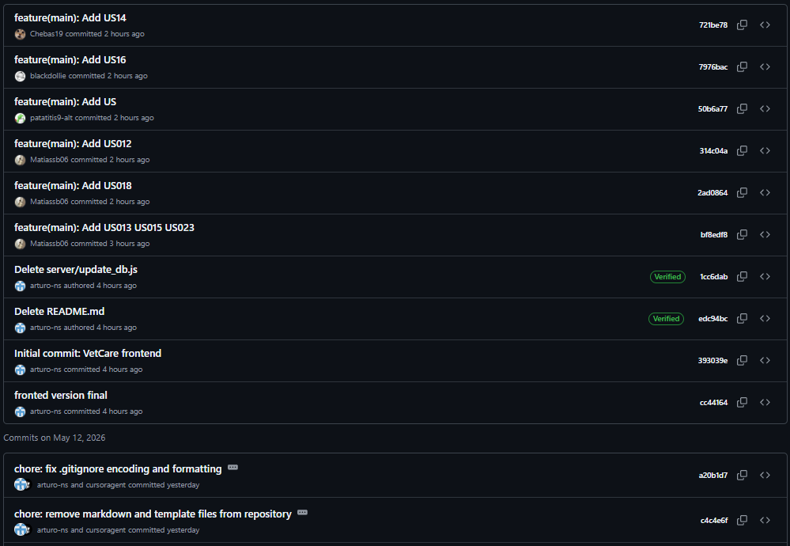

#### 5.2.2.5. Execution Evidence for Sprint Review

Durante este segundo Sprint, el equipo completó la implementación de los módulos interactivos de gestión clínica en la Web App. A continuación, se presenta la evidencia visual de las funcionalidades operativas que permiten al veterinario gestionar la consulta de manera digital:

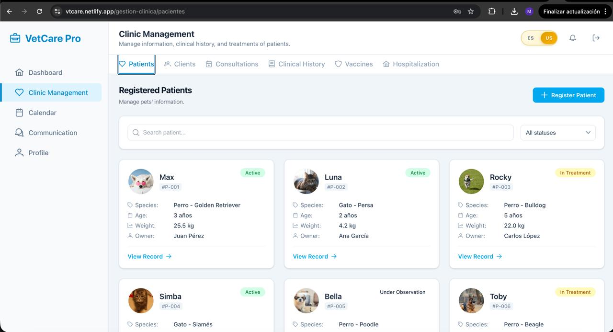
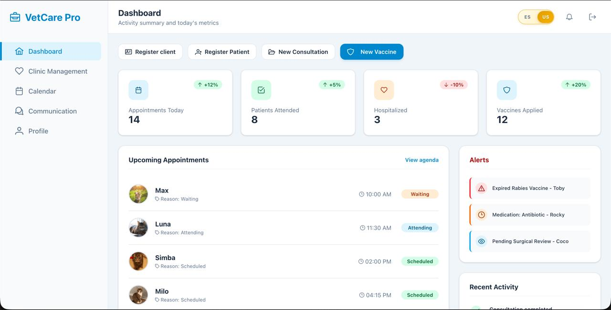
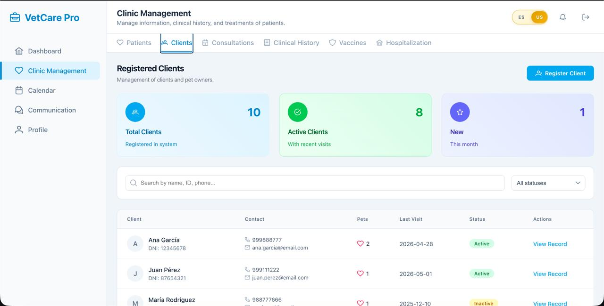
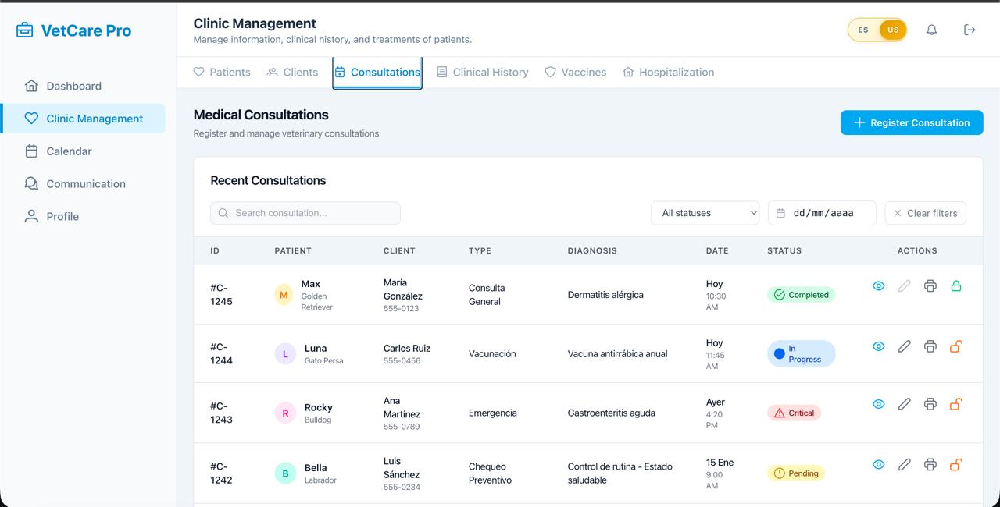
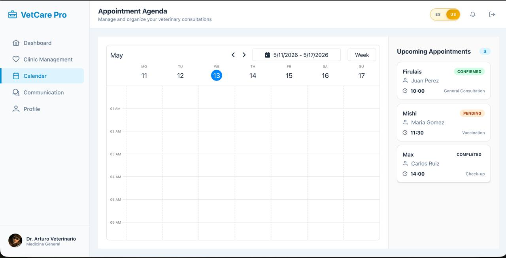
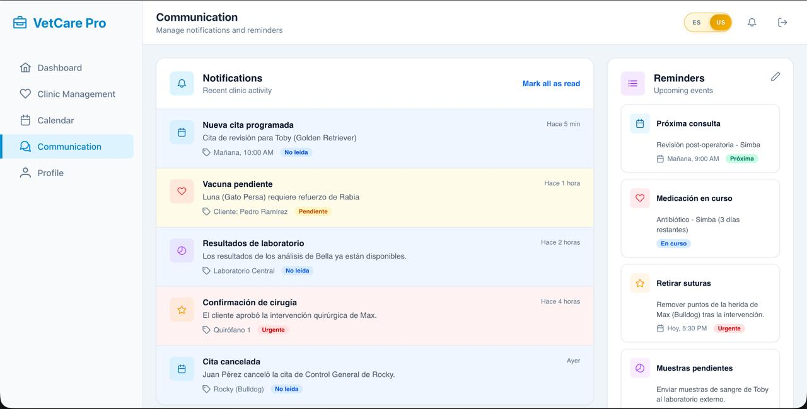
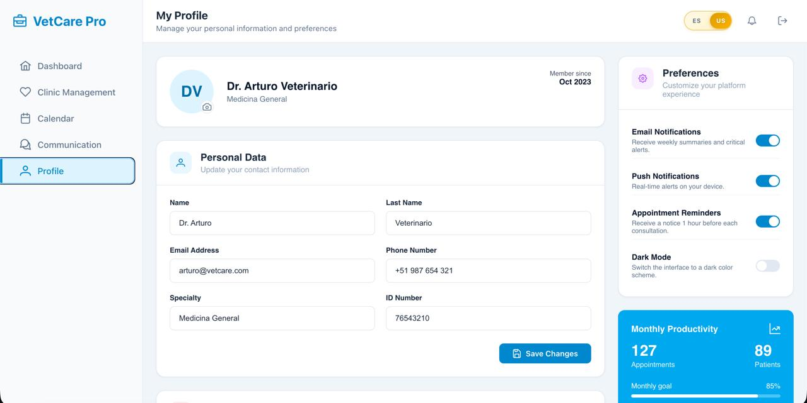
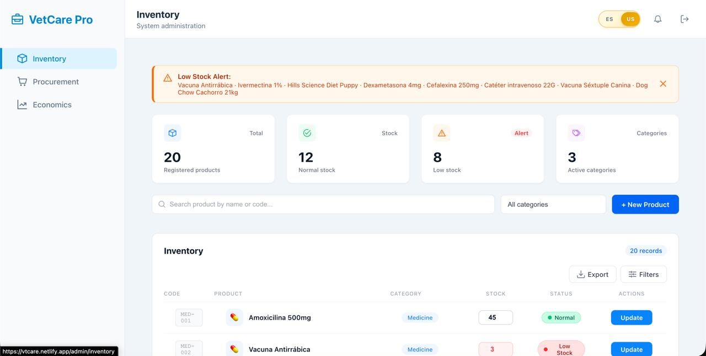
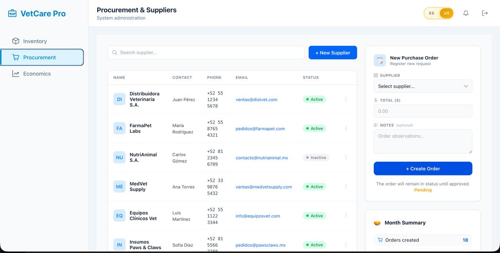
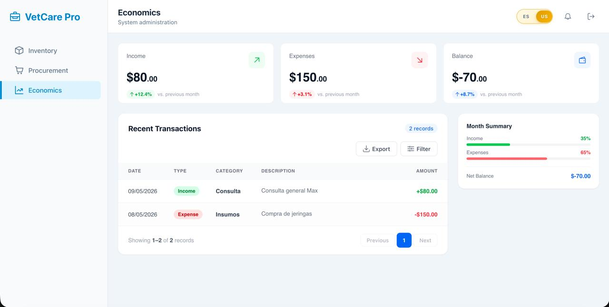

#### 5.2.2.6. Services Documentation Evidence for Sprint Review

Durante el Sprint 2, se documentaron los servicios y componentes clave que permiten la interactividad de la Web Application. A diferencia de la Landing Page, este desarrollo se centró en la lógica de negocio para la gestión de pacientes y la integridad de los datos médicos.

**1. Módulo de Triaje y Signos Vitales (US012):**
Se implementó un servicio centralizado para la captura de constantes fisiológicas. El sistema permite el ingreso de datos numéricos (peso en kg y temperatura en °C), validando que los rangos sean consistentes con la especie del paciente antes de su almacenamiento.

**2. Sistema de Alertas de Seguridad (US013):**
Se diseñó un servicio de notificaciones prioritarias que consulta el perfil del paciente al cargar la historia clínica. Si existen registros de alergias (ej. Penicilina), el sistema dispara un componente visual de advertencia inamovible en la cabecera de la interfaz.

**3. Servicio de Prescripción Digital (US014):**
Se desarrolló un generador de formularios para recetas médicas que permite estandarizar la dosificación y las instrucciones de uso. Este servicio está vinculado al ID de la consulta actual para mantener la trazabilidad del tratamiento.

**4. Gestión de Documentos y Resultados (US016):**
Se integró un módulo de manejo de archivos que permite la asociación de resultados de laboratorio (PDF/JPG) directamente al historial del paciente, facilitando la consulta centralizada de diagnósticos externos.

**5. Control de Notas y Cierre de Consulta (US018, US015):**
Se documentó la lógica de persistencia para las notas de anamnesis. Asimismo, se implementó el servicio de "bloqueo de registro" que, una vez finalizada la atención, cambia el estado de la consulta a solo lectura para cumplir con los estándares de integridad legal de la historia clínica.

#### 5.2.2.7. Software Deployment Evidence for Sprint Review

El despliegue de la aplicación web frontend se realizó utilizando **Netlify**, una plataforma de computación en la nube que ofrece servicios de alojamiento y backend para aplicaciones web estáticas y dinámicas. Se seleccionó esta herramienta por su capacidad de despliegue continuo (Continuous Deployment), permitiendo que cada actualización en el repositorio de la organización Animatik se refleje automáticamente en la URL de producción.

**Configuración del despliegue:**
* **Plataforma:** Netlify, uso de Swagger.
* **Rama de despliegue:** `main`.
* **Proceso:** Build automático mediante el comando `ng build` configurado en la plataforma.
* **Estado:** Operativo.

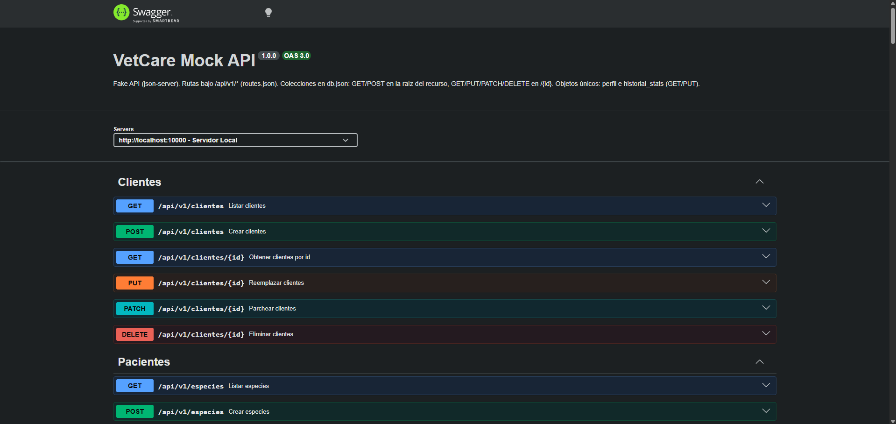

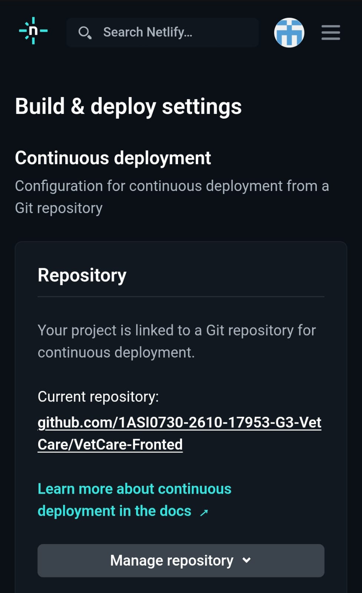
**URL de la Web App:** vtcare.netlify.app

#### 5.2.2.8. Team Collaboration Insights during Sprint

Durante el Sprint 2, la colaboración se centró en la transición hacia una arquitectura escalable en Angular. El equipo utilizó **Trello** para el seguimiento de las User Stories (12, 13, 14, 15, 16 y 18) y **GitFlow** para gestionar las contribuciones al código.

**Contribuciones al desarrollo del Frontend:**
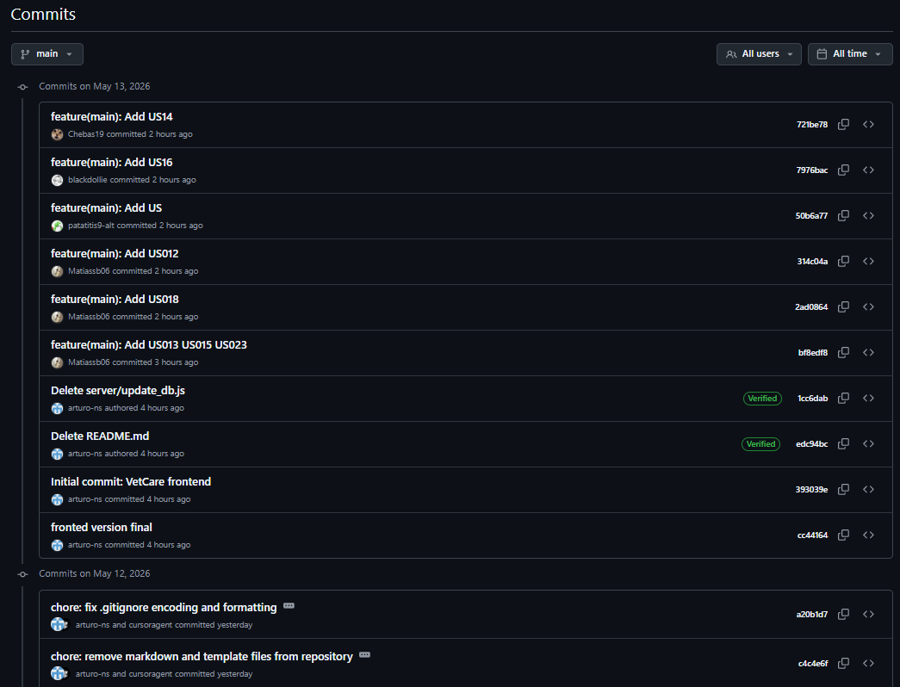

## 5.3. Validation Interviews

---

### 5.3.1. Diseño de Entrevistas

### 5.3.2. Registro de Entrevistas

### 5.3.3. Evaluaciones según heurísticas

## 5.4. Video About-the-Product

---

## Conclusiones

---

### Conclusiones y recomendaciones

### Video About-the-Team

---

## Bibliografía

Beyer, K., Chomiak-Orsa, I., Pietrzykowski, Z., & Rozkrut, D. (2025). *Digital transformation and business process improvement in veterinary clinics*. (pp. 201-213). https://doi.org/10.18276/978-83-8419-028-9-15

Mallikarjun, A., Charendoff, I., Moore, M. B., Wilson, C., Nguyen, E., Hendrzak, A. J., Poulson, J., Gibison, M., & Otto, C. M. (2024). Assessing Different Chronic Wasting Disease Training Aids for Use with Detection Dogs. *Animals*, *14*(2), 300. https://doi.org/10.3390/ani14020300

Soltani, Z., & Siadati, S. (2019). *The impact of business intelligence on increasing the efficiency and health quality of surgical centers*. (Research on Health Management and Efficiency).

---

## Anexos

---
